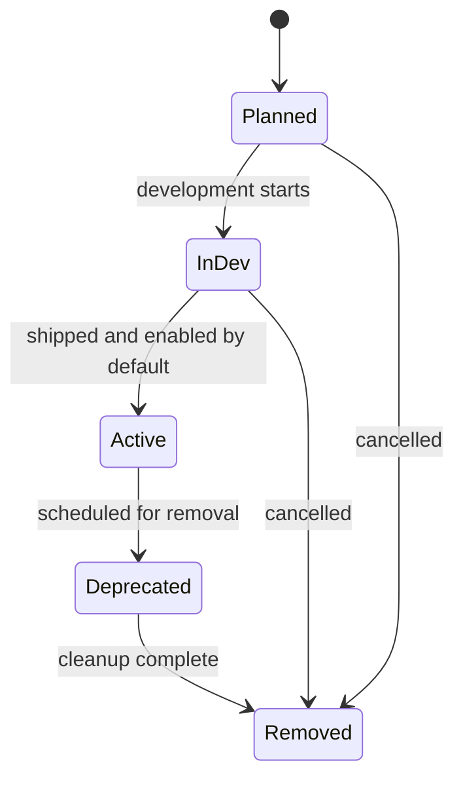

# Feature Flags Registry

This document is the single source of truth for all `ff_*` feature flags in `kdi`.

## Conventions

- Every new feature is gated behind an `ff_*` flag registered here before implementation.
- CLI / server environment variable form: `FF_ENABLE_<FEATURE>=false`
- Browser environment variable form: not applicable (kdi is a Bun CLI binary)
- All flags default to `false` in every environment unless explicitly promoted.
- A flag is removed from code and this registry only after completing the deprecation window.

## Lifecycle

## Registry

| Flag | Env Var | Scope | Status | Default | Since | Description |
|---|---|---|---|---|---|---|
| `ff_created_by` | `FF_CREATED_BY` | CLI / task metadata | InDev | `false` | KDI-007 | Tracks and displays the actor that created a task. |
| `ff_complete_metadata` | `FF_COMPLETE_METADATA` | CLI / complete | InDev | `false` | KDI-005 | Gates --metadata option only. Base --result / --summary always available. |
| `ff_kanban_dispatch` | `FF_ENABLE_KANBAN_DISPATCH` | CLI / dispatcher | Planned | `false` | — | Background dispatcher loop that polls ready tasks and spawns harness profiles. |
| `ff_scheduled_status` | `FF_SCHEDULED_STATUS` | CLI / task lifecycle | InDev | `false` | KDI-002 | Scheduled status, schedule/unblock commands, and scheduled_at field. |
| `ff_review_status` | `FF_REVIEW_STATUS` | CLI / task lifecycle | InDev | `false` | KDI-003 | Review status and review command. |
| `ff_priority_integer` | `FF_PRIORITY_INTEGER` | CLI / create | InDev | `false` | KDI-005 | Integer priority validation for create --priority (advisory — schema migration always runs). |

## Lifecycle Notes

### `ff_created_by` — InDev

- **Owner:** kdi core team
- **BRD:** [BRD-KDI-007](brd-kdi-007-created-by.md)
- **Status transitions:**
  - `InDev` → `Active` when creator tracking is safe to enable by default.
- **Activation criteria:**
  - `create --created-by` stores and displays the creator.
  - `list --created-by` filters tasks by creator.
  - `show` displays the creator when the flag is enabled.
- **Rollback / deactivation:** Set `FF_CREATED_BY=false` to hide creator fields and reject creator options.
- **Deprecation plan:** N/A

### `ff_scheduled_status` — InDev

- **Owner:** kdi core team
- **BRD:** KDI-002
- **Status transitions:**
  - `InDev` → `Active` when scheduling commands are safe to enable by default.
- **Activation criteria:**
  - `schedule` and `unblock` commands validate scheduled_at.
  - `create --initial-status scheduled` requires `--at`.
- **Rollback / deactivation:** Set `FF_SCHEDULED_STATUS=false` to disable scheduling commands.

### `ff_review_status` — InDev

- **Owner:** kdi core team
- **BRD:** KDI-003
- **Status transitions:**
  - `InDev` → `Active` when review command is safe to enable by default.
- **Activation criteria:**
  - `review` command transitions tasks to `review` status.
- **Rollback / deactivation:** Set `FF_REVIEW_STATUS=false` to disable review command.

### `ff_complete_metadata` — InDev

- **Owner:** kdi core team
- **BRD:** KDI-005
- **Status transitions:**
  - `Planned` → `InDev` when `--metadata` option is implemented.
- **Activation criteria:**
  - `complete --metadata <json>` stores metadata on completion.
  - Event payload correctly deserializes metadata.
- **Rollback / deactivation:** Set `FF_COMPLETE_METADATA=false` to hide/gate the `--metadata` option.
- **Deprecation plan:** N/A

### `ff_priority_integer` — InDev

- **Owner:** kdi core team
- **BRD:** KDI-004
- **Status transitions:**
  - `Planned` → `InDev` when integer priority validation is implemented (done).
- **Schema note:** Integer priority is a schema-level change (migration) — this flag is advisory for feature rollout; the schema migration always runs.
- **Activation criteria:**
  - `create --priority` rejects non-integer values when flag is enabled.
  - CLI help documents priority as integer only.
- **Rollback / deactivation:** Set `FF_PRIORITY_INTEGER=false` (disables integer validation; basic number validation still applies).
- **Deprecation plan:** N/A

### `ff_kanban_dispatch` — Planned

- **Owner:** kdi core team
- **BRD:** [BRD-KD-001](brd-kdi.md)
- **Status transitions:**
  - `Planned` → `InDev` when dispatcher module and first harness profile integration begin.
  - `InDev` → `Active` when dispatcher is safe to enable by default in production.
- **Activation criteria:**
  - Dispatcher claims ready tasks via CAS-style `ready → running` transition.
  - Harness profiles resolve from `~/.config/kdi/profiles.yaml`.
  - Worktree creation and command template substitution are covered by tests.
- **Rollback / deactivation:** Set `FF_ENABLE_KANBAN_DISPATCH=false` to stop the dispatcher loop while keeping board and task management commands available.
- **Deprecation plan:** N/A
