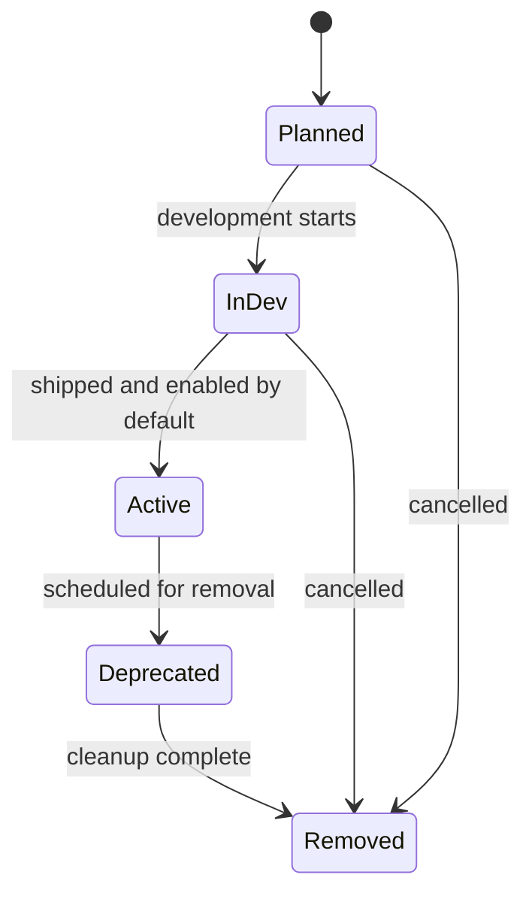

# Feature Flags Registry

This document is the single source of truth for all `ff_*` feature flags in `kdi`.

## Conventions

- Every new feature is gated behind an `ff_*` flag registered here before implementation.
- CLI / server environment variable form: `FF_<FEATURE>=false` (upper snake case of the flag name, e.g. `FF_COMPLETE_METADATA=false`). The dispatcher flag `ff_kanban_dispatch` uses the explicit env var `FF_ENABLE_KANBAN_DISPATCH` for historical reasons.
- Browser environment variable form: not applicable (kdi is a Bun CLI binary)
- All flags default to `false` in every environment unless explicitly promoted.
- A flag is removed from code and this registry only after completing the deprecation window.
- **Foundational commands** (`kdi init`, `kdi boards create`, `kdi boards list`, `kdi boards show`, `kdi boards archive`) are exempt from feature-flag gating. These commands provide the minimum viable surface for board and database management and must always be available.

## Lifecycle

## Registry

| Flag | Env Var | Scope | Status | Default | Since | Description |
|---|---|---|---|---|---|---|
| `ff_created_by` | `FF_CREATED_BY` | CLI / task metadata | InDev | `false` | KDI-007 | Tracks and displays the actor that created a task. |
| `ff_board_rm_delete` | `FF_BOARD_RM_DELETE` | CLI / board management | InDev | `false` | KDI-012c | Gates `boards rm --delete` permanent board deletion. |
| `ff_complete_metadata` | `FF_COMPLETE_METADATA` | CLI / complete | InDev | `false` | KDI-005 | Gates --metadata option only. Base --result / --summary always available. |
| `ff_kanban_dispatch` | `FF_ENABLE_KANBAN_DISPATCH` | CLI / dispatcher | Planned | `false` | — | Background dispatcher loop that polls ready tasks and spawns harness profiles. |
| `ff_scheduled_status` | `FF_SCHEDULED_STATUS` | CLI / task lifecycle | InDev | `false` | KDI-002 | Scheduled status, schedule/unblock commands, and scheduled_at field. |
| `ff_review_status` | `FF_REVIEW_STATUS` | CLI / task lifecycle | InDev | `false` | KDI-003 | Review status and review command. |
| `ff_priority_integer` | `FF_PRIORITY_INTEGER` | CLI / create | InDev | `false` | KDI-005 | Integer priority validation for create --priority (advisory — schema migration always runs). |
| `ff_tenant_namespace` | `FF_TENANT_NAMESPACE` | CLI / task lifecycle | InDev | `false` | KDI-006 | Tenant namespace on tasks; `create --tenant`; `list --tenant` filters by tenant. |
| `ff_skills_array` | `FF_SKILLS_ARRAY` | CLI / create, dispatcher | InDev | `false` | KDI-009 | Skills array on tasks; `create --skill`; dispatcher passes skills to harness via `{{skills}}` and `KDI_SKILLS`. |
| `ff_max_runtime` | `FF_MAX_RUNTIME` | CLI / create + dispatcher | InDev | `false` | KDI-008 | Per-task max runtime cap; dispatcher SIGTERMs/SIGKILLs worker when exceeded. |
| `ff_model_override` | `FF_MODEL_OVERRIDE` | CLI / create + dispatcher | InDev | `false` | KDI-010 | Per-task model override; `create --model`; dispatcher passes `{{model}}` and `KDI_MODEL` to harness. |
| `ff_max_retries` | `FF_MAX_RETRIES` | CLI / create + dispatcher | InDev | `false` | KDI-011 | Per-task max retries; auto-block after N consecutive spawn/execution failures. |
| `ff_rate_limit_exit_code` | `FF_RATE_LIMIT_EXIT_CODE` | CLI / dispatcher | InDev | `false` | KDI-016c | Treat harness exit code 75 (EX_TEMPFAIL) as a transient rate limit and requeue with a cooldown instead of counting it as a failure. |
| `ff_board_metadata` | `FF_BOARD_METADATA` | CLI / board metadata | InDev | `false` | KDI-012 | Board name, icon, and color; `boards create --name/--icon/--color`, `boards edit`, and metadata display. |
| `ff_board_switch` | `FF_BOARD_SWITCH` | CLI / board management | InDev | `false` | KDI-013 | Board switch command and resolution chain; `boards switch`, `boards show` without slug. |
| `ff_board_rename` | `FF_BOARD_RENAME` | CLI / board management | InDev | `false` | KDI-014 | Board rename command; `boards rename <old> <new>` renames slug and data directory. |
| `ff_default_workdir` | `FF_DEFAULT_WORKDIR` | CLI / board management + create | InDev | `false` | KDI-015 | Board default task workspace; `boards set-default-workdir`; create inheritance and `--workspace`. |
| `ff_assignees_listing` | `FF_ASSIGNEES_LISTING` | CLI / observability | InDev | `false` | KDI-024 | `kdi assignees` lists known profiles plus per-profile task counts for the current board. |
| `ff_heartbeat` | `FF_HEARTBEAT` | CLI / task lifecycle + dispatcher | InDev | `false` | KDI-016 | Worker heartbeat command and dispatcher stale-heartbeat reclaim. |
| `ff_crash_grace_period` | `FF_CRASH_GRACE_PERIOD` | CLI / dispatcher | InDev | `false` | KDI-016b | Crash grace period for slow-starting harnesses; delay PID liveness checks for 30s after spawn. |
| `ff_assign_reassign` | `FF_ASSIGN_REASSIGN` | CLI / task lifecycle | InDev | `false` | KDI-017 | Assign/reassign task assignee; `assign`, `reassign`, and `reassign --reclaim`. |
| `ff_worker_log_capture` | `FF_WORKER_LOG_CAPTURE` | CLI / dispatcher | InDev | `false` | KDI-018 | Worker stdout/stderr capture; `kdi log <task_id>` and `--tail`. |
| `ff_stats` | `FF_STATS` | CLI / observability | InDev | `false` | KDI-019 | Board stats command; per-status counts, per-assignee counts, oldest-ready age, and `--json` output. |
| `ff_gc` | `FF_GC` | CLI / maintenance | InDev | `false` | KDI-021 | Garbage collection command; prunes old events, old logs, and KDI-owned archived-task workspaces. |
| `ff_task_attachments` | `FF_TASK_ATTACHMENTS` | CLI / task metadata | InDev | `false` | KDI-022 | Task file attachments; `kdi attach <task_id> <file>` and attachment display in `kdi show`. |
| `ff_diagnostics` | `FF_DIAGNOSTICS` | CLI / observability | InDev | `false` | KDI-020 | Board diagnostics command; health-check rules, severity filtering, per-task mode, and `--json` output. |
| `ff_notify_subs` | `FF_NOTIFY_SUBS` | CLI / notifier watcher | Planned | `false` | KDI-025 | Notification subscriptions; `notify-subscribe/list/unsubscribe` commands; notifier watcher in dispatcher tick.

## Lifecycle Notes

### `ff_created_by` — InDev

- **Owner:** kdi core team
- **BRD:** [BRD-KDI-007](brd-kdi-007-created-by.md)
- **Status transitions:**
  - `InDev` → `Active` when creator tracking is safe to enable by default.
- **Activation criteria:**
  - `create --created-by` stores and displays the creator.
  - `list --created-by` filters tasks by creator.
  - `show` displays the creator when the flag is enabled.
- **Rollback / deactivation:** Set `FF_CREATED_BY=false` to hide creator fields and reject creator options.
- **Deprecation plan:** N/A

### `ff_board_rm_delete` — InDev

- **Owner:** kdi core team
- **BRD:** KDI-012c
- **Status transitions:**
  - `InDev` → `Active` when permanent board deletion is safe to enable by default.
- **Activation criteria:**
  - `boards rm <slug> --delete` removes the board row and recursively deletes the board data directory.
  - Without the flag, `--delete` is rejected with a clear error.
- **Rollback / deactivation:** Set `FF_BOARD_RM_DELETE=false` to reject `--delete` and keep soft-archive as the only removal path.
- **Deprecation plan:** N/A

### `ff_scheduled_status` — InDev

- **Owner:** kdi core team
- **BRD:** KDI-002
- **Status transitions:**
  - `InDev` → `Active` when scheduling commands are safe to enable by default.
- **Activation criteria:**
  - `schedule` and `unblock` commands validate scheduled_at.
  - `create --initial-status scheduled` requires `--at`.
- **Rollback / deactivation:** Set `FF_SCHEDULED_STATUS=false` to disable scheduling commands.

### `ff_review_status` — InDev

- **Owner:** kdi core team
- **BRD:** KDI-003
- **Status transitions:**
  - `InDev` → `Active` when review command is safe to enable by default.
- **Activation criteria:**
  - `review` command transitions tasks to `review` status.
- **Rollback / deactivation:** Set `FF_REVIEW_STATUS=false` to disable review command.

### `ff_complete_metadata` — InDev

- **Owner:** kdi core team
- **BRD:** KDI-005
- **Status transitions:**
  - `Planned` → `InDev` when `--metadata` option is implemented.
- **Activation criteria:**
  - `complete --metadata <json>` stores metadata on completion.
  - Event payload correctly deserializes metadata.
- **Rollback / deactivation:** Set `FF_COMPLETE_METADATA=false` to hide/gate the `--metadata` option.
- **Deprecation plan:** N/A

### `ff_priority_integer` — InDev

- **Owner:** kdi core team
- **BRD:** KDI-004
- **Status transitions:**
  - `Planned` → `InDev` when integer priority validation is implemented (done).
- **Schema note:** Integer priority is a schema-level change (migration) — this flag is advisory for feature rollout; the schema migration always runs.
- **Activation criteria:**
  - `create --priority` rejects non-integer values when flag is enabled.
  - CLI help documents priority as integer only.
- **Rollback / deactivation:** Set `FF_PRIORITY_INTEGER=false` (disables integer validation; basic number validation still applies).
- **Deprecation plan:** N/A

### `ff_tenant_namespace` — InDev

- **Owner:** kdi core team
- **BRD:** [BRD-KDI-006](brd-006-tenant-namespace.md)
- **Status transitions:**
  - `Planned` → `InDev` when tenant column and CLI options are implemented.
- **Schema note:** `tenant` is a schema-level TEXT column — this flag gates the CLI options; the schema migration always runs.
- **Activation criteria:**
  - `create --tenant <name>` stores tenant on the task.
  - `list --tenant <name>` filters tasks by tenant and composes with `--status` and `--assignee`.
  - `kdi show` displays the tenant when present.
- **Rollback / deactivation:** Set `FF_TENANT_NAMESPACE=false` to hide/gate the `--tenant` option.
- **Deprecation plan:** N/A

### `ff_skills_array` — InDev

- **Owner:** kdi core team
- **BRD:** [BRD-KDI-009](brd-kdi-009-skills-array.md)
- **Status transitions:**
  - `Planned` → `InDev` when skills array field and CLI option are implemented.
- **Schema note:** `skills` is a schema-level TEXT column (JSON array) — this flag gates the CLI option and dispatcher behavior; the schema migration always runs.
- **Activation criteria:**
  - `create --skill <skill>` can be repeated to build the task skills array.
  - `kdi show` displays skills as a comma-separated list.
  - Dispatcher substitutes `{{skills}}` in profile commands and sets `KDI_SKILLS` env var.
- **Rollback / deactivation:** Set `FF_SKILLS_ARRAY=false` to hide/gate the `--skill` option and dispatcher skill passing.
- **Deprecation plan:** N/A

### `ff_max_runtime` — InDev

- **Owner:** kdi core team
- **BRD:** [BRD-KDI-008](brd-kdi-008-max-runtime.md)
- **Status transitions:**
  - `Planned` → `InDev` when `max_runtime_seconds` column, `create --max-runtime`, and dispatcher enforcement are implemented.
- **Schema note:** `max_runtime_seconds` is a schema-level INTEGER column on `tasks` and `task_runs` — this flag gates the CLI option and dispatcher behavior; the schema migrations always run.
- **Activation criteria:**
  - `create --max-runtime <duration>` stores `max_runtime_seconds` on the task.
  - Dispatcher passes the cap as the harness timeout.
  - Timed-out runs are recorded with `outcome=timed_out` and the task is blocked.
- **Rollback / deactivation:** Set `FF_MAX_RUNTIME=false` to hide/gate the `--max-runtime` option.
- **Deprecation plan:** N/A

### `ff_model_override` — InDev

- **Owner:** kdi core team
- **BRD:** [BRD-KDI-010](brd-kdi-010-model-override.md)
- **Status transitions:**
  - `Planned` → `InDev` when `model_override` column, `create --model`, and dispatcher pass-through are implemented.
- **Schema note:** `model_override` is a schema-level TEXT column on `tasks` — this flag gates the CLI option and dispatcher behavior; the schema migration always runs.
- **Activation criteria:**
  - `create --model <model>` stores `model_override` on the task.
  - `kdi show` displays the model override when the flag is enabled.
  - Dispatcher substitutes `{{model}}` in profile commands and sets `KDI_MODEL` env var for the harness process.
- **Rollback / deactivation:** Set `FF_MODEL_OVERRIDE=false` to hide/gate the `--model` option and dispatcher model pass-through.
- **Deprecation plan:** N/A

### `ff_max_retries` — InDev

- **Owner:** kdi core team
- **BRD:** KDI-011
- **Status transitions:**
  - `Planned` → `InDev` when `max_retries` and `consecutive_failures` columns, `create --max-retries`, and dispatcher circuit breaker are implemented.
- **Schema note:** `max_retries` and `consecutive_failures` are schema-level INTEGER columns on `tasks` — this flag gates the CLI option and dispatcher retry behavior; the schema migrations always run.
- **Activation criteria:**
  - `create --max-retries <n>` stores `max_retries` on the task.
  - Dispatcher requeues failed tasks up to `max_retries` consecutive failures, then blocks them.
  - Successful harness runs reset `consecutive_failures` to 0.
- **Rollback / deactivation:** Set `FF_MAX_RETRIES=false` to hide/gate the `--max-retries` option.
- **Deprecation plan:** N/A

### `ff_rate_limit_exit_code` — InDev

- **Owner:** kdi core team
- **BRD:** [BRD-KDI-016c](brd-kdi-016c-rate-limit-exit-code.md)
- **Status transitions:**
  - `Planned` → `InDev` when dispatcher recognizes exit code 75 and applies a cooldown before requeuing.
- **Schema note:** `rate_limited_until` is a schema-level INTEGER column on `tasks` — this flag gates the dispatcher behavior and CLI option; the schema migration always runs.
- **Activation criteria:**
  - A harness exiting 75 transitions the task to `ready` without incrementing `consecutive_failures`.
  - `rate_limited_until` is set to `now + cooldown_seconds` and the dispatcher skips the task until that time passes.
  - `kdi dispatch --rate-limit-cooldown <duration>` overrides the default cooldown when the flag is enabled.
- **Rollback / deactivation:** Set `FF_RATE_LIMIT_EXIT_CODE=false` to treat exit 75 as a normal harness failure.
- **Deprecation plan:** N/A

### `ff_board_metadata` — InDev

- **Owner:** kdi core team
- **BRD:** KDI-012
- **Status transitions:**
  - `Planned` → `InDev` when `boards` metadata columns and CLI options are implemented.
- **Schema note:** `name`, `icon`, and `color` are schema-level TEXT columns on `boards` — this flag gates the CLI options and display; the schema migrations always run.
- **Activation criteria:**
  - `boards create --name/--icon/--color` stores metadata on the board.
  - `boards edit` updates board metadata.
  - `boards show` and `boards list` display metadata when set.
- **Rollback / deactivation:** Set `FF_BOARD_METADATA=false` to hide/gate the `--name`, `--icon`, `--color`, and `boards edit` options.
- **Deprecation plan:** N/A

### `ff_board_switch` — InDev

- **Owner:** kdi core team
- **BRD:** KDI-013
- **Status transitions:**
  - `Planned` → `InDev` when board switch command and resolution chain are implemented.
- **Activation criteria:**
  - `boards switch <slug>` writes to `~/.local/share/kdi/current`.
  - `boards show` without slug resolves the current board via the chain.
  - Resolution chain: `--board` flag → `KDI_BOARD` env → current file → `"default"`.
- **Rollback / deactivation:** Set `FF_BOARD_SWITCH=false` to reject the `boards switch` command and disable chain resolution.
- **Deprecation plan:** N/A

### `ff_board_rename` — InDev

- **Owner:** kdi core team
- **BRD:** KDI-014
- **Status transitions:**
  - `Planned` → `InDev` when board rename command is implemented.
- **Activation criteria:**
  - `boards rename <old> <new>` updates the slug, renames the data directory, and updates the current-board file.
  - All error cases handled: invalid slugs, same slug, not found, archived, slug conflict.
- **Rollback / deactivation:** Set `FF_BOARD_RENAME=false` to reject the `boards rename` command.
- **Deprecation plan:** N/A

### `ff_default_workdir` — InDev

- **Owner:** kdi core team
- **BRD:** KDI-015
- **Status transitions:**
  - `Planned` → `InDev` when board default workdir storage and create inheritance are implemented.
- **Schema note:** `default_workdir` is a schema-level TEXT column on `boards`; task `workspace` is persisted so inherited/explicit workspaces can be used by the dispatcher. This flag gates the CLI command, `create --workspace`, and default inheritance.
- **Activation criteria:**
  - `boards set-default-workdir <slug> <path>` stores and displays the default workdir.
  - `boards set-default-workdir <slug>` clears the default workdir.
  - `create` inherits the board default when `--workspace` is omitted.
  - `create --workspace <path>` overrides the board default.
- **Rollback / deactivation:** Set `FF_DEFAULT_WORKDIR=false` to reject the command and prevent create from inheriting board defaults.
- **Deprecation plan:** N/A

### `ff_heartbeat` — InDev

- **Owner:** kdi core team
- **BRD:** [BRD-KDI-016](brd-kdi-016-heartbeat.md)
- **Status transitions:**
  - `InDev` → `Active` when heartbeat command and stale-heartbeat reclaim are safe to enable by default.
- **Activation criteria:**
  - `kdi heartbeat <task_id>` updates `last_heartbeat_at` on the task and active run.
  - `kdi heartbeat <task_id> --note "..."` records a `heartbeat` event.
  - The dispatcher reclaims `running` tasks whose `last_heartbeat_at` is older than 60 minutes.
- **Rollback / deactivation:** Set `FF_HEARTBEAT=false` to reject the `kdi heartbeat` command and disable stale-heartbeat reclaim.
- **Deprecation plan:** N/A

### `ff_crash_grace_period` — InDev

- **Owner:** kdi core team
- **BRD:** [BRD-KDI-016b](brd-kdi-016b-crash-grace.md)
- **Status transitions:**
  - `Planned` → `InDev` when PID liveness monitor and grace-period logic are implemented.
  - `InDev` → `Active` when the grace window is safe to enable by default.
- **Schema note:** `spawned_at` is a schema-level INTEGER column on `task_runs` — this flag gates the dispatcher behavior and display; the schema migration always runs.
- **Activation criteria:**
  - Dispatcher records `worker_pid` on the active run at spawn time.
  - PID liveness monitor skips runs whose `started_at`/`spawned_at` is within the configured 30-second grace period.
  - Runs with a dead PID after the grace period are finalized with `outcome=crashed` and the task is blocked.
- **Rollback / deactivation:** Set `FF_CRASH_GRACE_PERIOD=false` to disable the PID liveness grace period and retain pre-feature behavior.
- **Deprecation plan:** N/A

### `ff_assign_reassign` — InDev

- **Owner:** kdi core team
- **BRD:** [BRD-KDI-017](brd-kdi-017-assign-reassign.md)
- **Status transitions:**
  - `Planned` → `InDev` when `assign`, `reassign`, and `--reclaim` CLI commands are implemented.
- **Schema note:** No schema changes; reuses existing `tasks.assignee` TEXT column and `idx_tasks_assignee` index.
- **Activation criteria:**
  - `kdi assign <task_id> <profile>` and `kdi reassign <task_id> <profile>` update the task assignee.
  - `kdi assign <task_id> none` and `kdi reassign <task_id> none` clear the assignee.
  - `kdi reassign <task_id> <profile> --reclaim [--reason <text>]` releases an active claim before updating the assignee.
  - `assigned` and `reclaimed` events are emitted appropriately.
- **Rollback / deactivation:** Set `FF_ASSIGN_REASSIGN=false` to reject the `assign` and `reassign` commands and the `--reason` option on `reclaim`.
- **Deprecation plan:** N/A

### `ff_worker_log_capture` — InDev

- **Owner:** kdi core team
- **BRD:** [BRD-KDI-018](brd-kdi-018-worker-log-capture.md)
- **Status transitions:**
  - `Planned` → `InDev` when dispatcher log streaming and `kdi log` command are implemented.
  - `InDev` → `Active` when log capture is safe to enable by default.
- **Schema note:** No schema changes; log path is derived from board slug and task ID at runtime.
- **Activation criteria:**
  - Dispatcher writes combined stdout/stderr to `~/.local/share/kdi/logs/<board>/<task_id>.log`.
  - `kdi log <task_id>` prints the captured log.
  - `kdi log <task_id> --tail <bytes>` prints only trailing bytes.
- **Rollback / deactivation:** Set `FF_WORKER_LOG_CAPTURE=false` to reject `kdi log` and disable per-task log file creation.
- **Deprecation plan:** N/A

### `ff_stats` — InDev

- **Owner:** kdi core team
- **BRD:** [BRD-KDI-019](brd-019-stats.md)
- **Status transitions:**
  - `Planned` → `InDev` when `kdi stats` command and query helpers are implemented.
  - `InDev` → `Active` when stats output is stable and safe to enable by default.
- **Schema note:** No schema changes; reads from the existing `tasks` table and `idx_tasks_board_status` index.
- **Activation criteria:**
  - `kdi stats` prints per-status counts, per-assignee counts, and oldest-ready age.
  - `kdi stats --json` emits a stable JSON document.
  - Flag gating rejects the command with a clear error when disabled.
- **Rollback / deactivation:** Set `FF_STATS=false` to reject the `stats` command.
- **Deprecation plan:** N/A

### `ff_gc` — InDev

- **Owner:** kdi core team
- **BRD:** [BRD-KDI-021](brd-kdi-021-gc.md)
- **Status transitions:**
  - `Planned` → `InDev` when `kdi gc` command and garbage-collection helpers are implemented.
  - `InDev` → `Active` when cleanup logic is safe to enable by default.
- **Schema note:** No schema changes; deletes from existing `tasks`, `task_events`, and `boards` tables and removes files from the existing log directory layout.
- **Activation criteria:**
  - `kdi gc --event-retention-days N` deletes task events older than N days.
  - `kdi gc --log-retention-days N` deletes worker logs older than N days.
  - `kdi gc` cleans KDI-owned workspaces for archived tasks.
  - Flag gating rejects the command with a clear error when disabled.
- **Rollback / deactivation:** Set `FF_GC=false` to reject the `gc` command.
- **Deprecation plan:** N/A

### `ff_assignees_listing` — InDev

- **Owner:** kdi core team
- **BRD:** KDI-024
- **Status transitions:**
  - `Planned` → `InDev` when `kdi assignees` command and assignee-count query are implemented.
- **Schema note:** No schema changes; reads from the existing `tasks` table and `idx_tasks_assignee` index.
- **Activation criteria:**
  - `kdi assignees [--board <slug>]` lists known profiles merged with assignees present on the resolved board.
  - Each listed profile shows the count of non-archived tasks assigned to it on that board.
  - `--json` emits a stable JSON document with the board slug and an array of `{ profile, count }` rows.
- **Rollback / deactivation:** Set `FF_ASSIGNEES_LISTING=false` to reject the `assignees` command.
- **Deprecation plan:** N/A

### `ff_task_attachments` — InDev

- **Owner:** kdi core team
- **BRD:** [BRD-KDI-022](brd-kdi-022-task-attachments.md)
- **Status transitions:**
  - `Planned` → `InDev` when `task_attachments` table, `kdi attach`, and `kdi show` display are implemented.
- **Schema note:** `task_attachments` is a schema-level table — this flag gates the CLI command and display; the schema migration always runs.
- **Activation criteria:**
  - `kdi attach <task_id> <file>` copies the file to board storage and records metadata.
  - `kdi show <id>` lists attachments when the flag is enabled.
  - Board hard-delete removes attachment rows and files.
- **Rollback / deactivation:** Set `FF_TASK_ATTACHMENTS=false` to reject `kdi attach` and hide attachment display.
- **Deprecation plan:** N/A

### `ff_diagnostics` — InDev

- **Owner:** kdi core team
- **BRD:** [BRD-KDI-020](brd-kdi-020-diagnostics.md)
- **Status transitions:**
  - `Planned` → `InDev` when `kdi diagnostics` command and rule engine are implemented.
  - `InDev` → `Active` when diagnostic rules are stable and safe to enable by default.
- **Activation criteria:**
  - `kdi diagnostics` runs board-wide health checks and prints findings.
  - `kdi diagnostics --severity {warning|error|critical}` filters by minimum severity.
  - `kdi diagnostics --task <task_id>` restricts findings to a single task.
  - `kdi diagnostics --json` emits a stable JSON array of findings.
- **Rollback / deactivation:** Set `FF_DIAGNOSTICS=false` to reject the `diagnostics` command.
- **Deprecation plan:** N/A

### `ff_notify_subs` — Planned

- **Owner:** kdi core team
- **BRD:** [BRD-KDI-025](brd-kdi-025-notification-subscriptions.md)
- **Status transitions:**
  - `Planned` → `InDev` when subscription table, CLI commands, notifier profiles file, and notifier watcher are implemented.
  - `InDev` → `Active` when notification delivery is safe to enable by default.
- **Schema note:** `kanban_notify_subs` is a schema-level table — this flag gates the CLI commands and watcher loop; the schema migration always runs.
- **Activation criteria:**
  - `notify-subscribe/list/unsubscribe` commands create, query, and remove subscriptions.
  - Notifier profiles load from `~/.config/kdi/notifiers.yaml`.
  - Notifier watcher delivers events to subscribed transports.
  - `log` built-in notifier profile always available.
- **Rollback / deactivation:** Set `FF_NOTIFY_SUBS=false` to reject notify commands and disable the notifier watcher.

### `ff_kanban_dispatch` — Planned

- **Owner:** kdi core team
- **BRD:** [BRD-KD-001](brd-kdi.md)
- **Status transitions:**
  - `Planned` → `InDev` when dispatcher module and first harness profile integration begin.
  - `InDev` → `Active` when dispatcher is safe to enable by default in production.
- **Activation criteria:**
  - Dispatcher claims ready tasks via CAS-style `ready → running` transition.
  - Harness profiles resolve from `~/.config/kdi/profiles.yaml`.
  - Worktree creation and command template substitution are covered by tests.
- **Rollback / deactivation:** Set `FF_ENABLE_KANBAN_DISPATCH=false` to stop the dispatcher loop while keeping board and task management commands available.
- **Deprecation plan:** N/A
