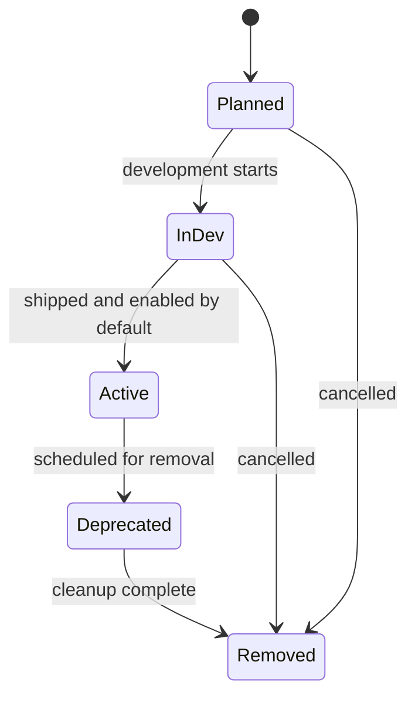

# Feature Flags Registry

This document is the single source of truth for all `ff_*` feature flags in `kdi`.

## Conventions

- Every new feature is gated behind an `ff_*` flag registered here before implementation.
- CLI / server environment variable form: `FF_<FEATURE>=false` (upper snake case of the flag name, e.g. `FF_COMPLETE_METADATA=false`). The dispatcher flag `ff_kanban_dispatch` uses the explicit env var `FF_ENABLE_KANBAN_DISPATCH` for historical reasons.
- Browser environment variable form: not applicable (kdi is a Bun CLI binary)
- All flags default to `false` in every environment unless explicitly promoted.
- A flag is removed from code and this registry only after completing the deprecation window.
- **Foundational commands** (`kdi init`, `kdi boards create`, `kdi boards list`, `kdi boards show`, `kdi boards archive`) are exempt from feature-flag gating. These commands provide the minimum viable surface for board and database management and must always be available.

## Lifecycle

## Registry

| Flag | Env Var | Scope | Status | Default | Since | Description |
|---|---|---|---|---|---|---|
| `ff_created_by` | `FF_CREATED_BY` | CLI / task metadata | InDev | `false` | KDI-007 | Tracks and displays the actor that created a task. |
| `ff_board_rm_delete` | `FF_BOARD_RM_DELETE` | CLI / board management | InDev | `false` | KDI-012c | Gates `boards rm --delete` permanent board deletion. |
| `ff_complete_metadata` | `FF_COMPLETE_METADATA` | CLI / complete | InDev | `false` | KDI-005 | Gates --metadata option only. Base --result / --summary always available. |
| `ff_kanban_dispatch` | `FF_ENABLE_KANBAN_DISPATCH` | CLI / dispatcher | Planned | `false` | — | Background dispatcher loop that polls ready tasks and spawns harness profiles. |
| `ff_scheduled_status` | `FF_SCHEDULED_STATUS` | CLI / task lifecycle | InDev | `false` | KDI-002 | Scheduled status, schedule/unblock commands, and scheduled_at field. |
| `ff_review_status` | `FF_REVIEW_STATUS` | CLI / task lifecycle | InDev | `false` | KDI-003 | Review status and review command. |
| `ff_priority_integer` | `FF_PRIORITY_INTEGER` | CLI / create | InDev | `false` | KDI-005 | Integer priority validation for create --priority (advisory — schema migration always runs). |
| `ff_tenant_namespace` | `FF_TENANT_NAMESPACE` | CLI / task lifecycle | InDev | `false` | KDI-006 | Tenant namespace on tasks; `create --tenant`; `list --tenant` filters by tenant. |
| `ff_skills_array` | `FF_SKILLS_ARRAY` | CLI / create, dispatcher | InDev | `false` | KDI-009 | Skills array on tasks; `create --skill`; dispatcher passes skills to harness via `{{skills}}` and `KDI_SKILLS`. |
| `ff_max_runtime` | `FF_MAX_RUNTIME` | CLI / create + dispatcher | InDev | `false` | KDI-008 | Per-task max runtime cap; dispatcher SIGTERMs/SIGKILLs worker when exceeded. |
| `ff_model_override` | `FF_MODEL_OVERRIDE` | CLI / create + dispatcher | InDev | `false` | KDI-010 | Per-task model override; `create --model`; dispatcher passes `{{model}}` and `KDI_MODEL` to harness. |
| `ff_max_retries` | `FF_MAX_RETRIES` | CLI / create + dispatcher | InDev | `false` | KDI-011 | Per-task max retries; auto-block after N consecutive spawn/execution failures. |
| `ff_rate_limit_exit_code` | `FF_RATE_LIMIT_EXIT_CODE` | CLI / dispatcher | InDev | `false` | KDI-016c | Treat harness exit code 75 (EX_TEMPFAIL) as a transient rate limit and requeue with a cooldown instead of counting it as a failure. |
| `ff_board_metadata` | `FF_BOARD_METADATA` | CLI / board metadata | InDev | `false` | KDI-012 | Board name, icon, and color; `boards create --name/--icon/--color`, `boards edit`, and metadata display. |
| `ff_board_switch` | `FF_BOARD_SWITCH` | CLI / board management | InDev | `false` | KDI-013 | Board switch command and resolution chain; `boards switch`, `boards show` without slug. |
| `ff_board_rename` | `FF_BOARD_RENAME` | CLI / board management | InDev | `false` | KDI-014 | Board rename command; `boards rename <old> <new>` renames slug and data directory. |
| `ff_default_workdir` | `FF_DEFAULT_WORKDIR` | CLI / board management + create | InDev | `false` | KDI-015 | Board default task workspace; `boards set-default-workdir`; create inheritance and `--workspace`. |
| `ff_assignees_listing` | `FF_ASSIGNEES_LISTING` | CLI / observability | InDev | `false` | KDI-024 | `kdi assignees` lists known profiles plus per-profile task counts for the current board. |
| `ff_heartbeat` | `FF_HEARTBEAT` | CLI / task lifecycle + dispatcher | InDev | `false` | KDI-016 | Worker heartbeat command and dispatcher stale-heartbeat reclaim. |
| `ff_crash_grace_period` | `FF_CRASH_GRACE_PERIOD` | CLI / dispatcher | InDev | `false` | KDI-016b | Crash grace period for slow-starting harnesses; delay PID liveness checks for 30s after spawn. |
| `ff_assign_reassign` | `FF_ASSIGN_REASSIGN` | CLI / task lifecycle | InDev | `false` | KDI-017 | Assign/reassign task assignee; `assign`, `reassign`, and `reassign --reclaim`. |
| `ff_worker_log_capture` | `FF_WORKER_LOG_CAPTURE` | CLI / dispatcher | InDev | `false` | KDI-018 | Worker stdout/stderr capture; `kdi log <task_id>` and `--tail`. |
| `ff_stats` | `FF_STATS` | CLI / observability | InDev | `false` | KDI-019 | Board stats command; per-status counts, per-assignee counts, oldest-ready age, and `--json` output. |
| `ff_gc` | `FF_GC` | CLI / maintenance | InDev | `false` | KDI-021 | Garbage collection command; prunes old events, old logs, and KDI-owned archived-task workspaces. |
| `ff_task_attachments` | `FF_TASK_ATTACHMENTS` | CLI / task metadata | InDev | `false` | KDI-022 | Task file attachments; `kdi attach <task_id> <file>` and attachment display in `kdi show`. |
| `ff_diagnostics` | `FF_DIAGNOSTICS` | CLI / observability | InDev | `false` | KDI-020 | Board diagnostics command; health-check rules, severity filtering, per-task mode, and `--json` output. |
| `ff_context_builder` | `FF_CONTEXT_BUILDER` | CLI / task context | InDev | `false` | KDI-023 | `kdi context` bounded worker context builder. |
| `ff_notify_subs` | `FF_NOTIFY_SUBS` | CLI / notifier watcher | InDev | `false` | KDI-025 | Notification subscriptions; `notify-subscribe/list/unsubscribe` commands; notifier watcher in dispatcher tick.
| `ff_list_filters_sort` | `FF_LIST_FILTERS_SORT` | CLI / task listing | InDev | `false` | KDI-030 | `kdi list` filters (`--mine`, `--session`, `--archived`, workflow/step-key) and sort options; `create --session`.
| `ff_show_run_filtering` | `FF_SHOW_RUN_FILTERING` | CLI / task inspection | InDev | `false` | KDI-031 | `kdi show` run section and `--state-type`/`--state-name` run filtering.
| `ff_runs_filtering` | `FF_RUNS_FILTERING` | CLI / task inspection | InDev | `false` | KDI-036 | `kdi runs` `--state-type`/`--state-name` run filtering.
| `ff_bulk_operations` | `FF_BULK_OPERATIONS` | CLI / task lifecycle | InDev | `false` | KDI-032 | Bulk `block`/`promote`/`archive --rm`; `promote --force` and `--dry-run`.
| `ff_comment_enhancements` | `FF_COMMENT_ENHANCEMENTS` | CLI / task metadata | InDev | `false` | KDI-033 | `kdi comment --author`/`--max-len` and author display in `kdi show`.
| `ff_dispatch_controls` | `FF_DISPATCH_CONTROLS` | CLI / dispatcher | InDev | `false` | KDI-034 | `kdi dispatch --failure-limit` per-pass failure threshold.
| `ff_watch_filters` | `FF_WATCH_FILTERS` | CLI / observability | InDev | `false` | KDI-035 | `kdi watch --assignee`/`--tenant`/`--kinds`/`--interval` filters.
| `ff_workflow_templates` | `FF_WORKFLOW_TEMPLATES` | CLI / task lifecycle | InDev | `false` | KDI-039 | Step-key driven workflow templates; `kdi create --workflow-template-id`, `kdi step`, `kdi workflows`.
| `ff_triage_automation` | `FF_TRIAGE_AUTOMATION` | CLI / task lifecycle | InDev | `false` | KDI-040 | LLM-powered triage automation; `kdi specify` (LLM path) and `kdi decompose`. |
| `ff_swarm_mode` | `FF_SWARM_MODE` | CLI / dispatcher | InDev | `false` | KDI-041 | Multi-agent task graph: `kdi swarm` creates parallel workers, a verifier, and a synthesizer bound by dependencies. |
| `ff_dispatcher_presence_warning` | `FF_DISPATCHER_PRESENCE_WARNING` | CLI / dispatcher + create | InDev | `false` | KDI-037 | `kdi create` warns on stderr when no live dispatcher is detected for the target board; `--no-dispatcher-warning` per-invocation escape. |
| `ff_goal_mode` | `FF_GOAL_MODE` | CLI / create + dispatcher | InDev | `false` | KDI-038 | Ralph-style multi-turn goal loop; `kdi create --goal`/`--goal-max-turns`/`--goal-judge`; dispatcher decrements a turn budget and requeues until the (v1 approximated) judge says done.

## Lifecycle Notes

### `ff_created_by` — InDev

- **Owner:** kdi core team
- **BRD:** [BRD-KDI-007](brd-kdi-007-created-by.md)
- **Status transitions:**
  - `InDev` → `Active` when creator tracking is safe to enable by default.
- **Activation criteria:**
  - `create --created-by` stores and displays the creator.
  - `list --created-by` filters tasks by creator.
  - `show` displays the creator when the flag is enabled.
- **Rollback / deactivation:** Set `FF_CREATED_BY=false` to hide creator fields and reject creator options.
- **Deprecation plan:** N/A

### `ff_board_rm_delete` — InDev

- **Owner:** kdi core team
- **BRD:** KDI-012c
- **Status transitions:**
  - `InDev` → `Active` when permanent board deletion is safe to enable by default.
- **Activation criteria:**
  - `boards rm <slug> --delete` removes the board row and recursively deletes the board data directory.
  - Without the flag, `--delete` is rejected with a clear error.
- **Rollback / deactivation:** Set `FF_BOARD_RM_DELETE=false` to reject `--delete` and keep soft-archive as the only removal path.
- **Deprecation plan:** N/A

### `ff_scheduled_status` — InDev

- **Owner:** kdi core team
- **BRD:** KDI-002
- **Status transitions:**
  - `InDev` → `Active` when scheduling commands are safe to enable by default.
- **Activation criteria:**
  - `schedule` and `unblock` commands validate scheduled_at.
  - `create --initial-status scheduled` requires `--at`.
- **Rollback / deactivation:** Set `FF_SCHEDULED_STATUS=false` to disable scheduling commands.

### `ff_review_status` — InDev

- **Owner:** kdi core team
- **BRD:** KDI-003
- **Status transitions:**
  - `InDev` → `Active` when review command is safe to enable by default.
- **Activation criteria:**
  - `review` command transitions tasks to `review` status.
- **Rollback / deactivation:** Set `FF_REVIEW_STATUS=false` to disable review command.

### `ff_complete_metadata` — InDev

- **Owner:** kdi core team
- **BRD:** KDI-005
- **Status transitions:**
  - `Planned` → `InDev` when `--metadata` option is implemented.
- **Activation criteria:**
  - `complete --metadata <json>` stores metadata on completion.
  - Event payload correctly deserializes metadata.
- **Rollback / deactivation:** Set `FF_COMPLETE_METADATA=false` to hide/gate the `--metadata` option.
- **Deprecation plan:** N/A

### `ff_priority_integer` — InDev

- **Owner:** kdi core team
- **BRD:** KDI-004
- **Status transitions:**
  - `Planned` → `InDev` when integer priority validation is implemented (done).
- **Schema note:** Integer priority is a schema-level change (migration) — this flag is advisory for feature rollout; the schema migration always runs.
- **Activation criteria:**
  - `create --priority` rejects non-integer values when flag is enabled.
  - CLI help documents priority as integer only.
- **Rollback / deactivation:** Set `FF_PRIORITY_INTEGER=false` (disables integer validation; basic number validation still applies).
- **Deprecation plan:** N/A

### `ff_tenant_namespace` — InDev

- **Owner:** kdi core team
- **BRD:** [BRD-KDI-006](brd-006-tenant-namespace.md)
- **Status transitions:**
  - `Planned` → `InDev` when tenant column and CLI options are implemented.
- **Schema note:** `tenant` is a schema-level TEXT column — this flag gates the CLI options; the schema migration always runs.
- **Activation criteria:**
  - `create --tenant <name>` stores tenant on the task.
  - `list --tenant <name>` filters tasks by tenant and composes with `--status` and `--assignee`.
  - `kdi show` displays the tenant when present.
- **Rollback / deactivation:** Set `FF_TENANT_NAMESPACE=false` to hide/gate the `--tenant` option.
- **Deprecation plan:** N/A

### `ff_skills_array` — InDev

- **Owner:** kdi core team
- **BRD:** [BRD-KDI-009](brd-kdi-009-skills-array.md)
- **Status transitions:**
  - `Planned` → `InDev` when skills array field and CLI option are implemented.
- **Schema note:** `skills` is a schema-level TEXT column (JSON array) — this flag gates the CLI option and dispatcher behavior; the schema migration always runs.
- **Activation criteria:**
  - `create --skill <skill>` can be repeated to build the task skills array.
  - `kdi show` displays skills as a comma-separated list.
  - Dispatcher substitutes `{{skills}}` in profile commands and sets `KDI_SKILLS` env var.
- **Rollback / deactivation:** Set `FF_SKILLS_ARRAY=false` to hide/gate the `--skill` option and dispatcher skill passing.
- **Deprecation plan:** N/A

### `ff_max_runtime` — InDev

- **Owner:** kdi core team
- **BRD:** [BRD-KDI-008](brd-kdi-008-max-runtime.md)
- **Status transitions:**
  - `Planned` → `InDev` when `max_runtime_seconds` column, `create --max-runtime`, and dispatcher enforcement are implemented.
- **Schema note:** `max_runtime_seconds` is a schema-level INTEGER column on `tasks` and `task_runs` — this flag gates the CLI option and dispatcher behavior; the schema migrations always run.
- **Activation criteria:**
  - `create --max-runtime <duration>` stores `max_runtime_seconds` on the task.
  - Dispatcher passes the cap as the harness timeout.
  - Timed-out runs are recorded with `outcome=timed_out` and the task is blocked.
- **Rollback / deactivation:** Set `FF_MAX_RUNTIME=false` to hide/gate the `--max-runtime` option.
- **Deprecation plan:** N/A

### `ff_model_override` — InDev

- **Owner:** kdi core team
- **BRD:** [BRD-KDI-010](brd-kdi-010-model-override.md)
- **Status transitions:**
  - `Planned` → `InDev` when `model_override` column, `create --model`, and dispatcher pass-through are implemented.
- **Schema note:** `model_override` is a schema-level TEXT column on `tasks` — this flag gates the CLI option and dispatcher behavior; the schema migration always runs.
- **Activation criteria:**
  - `create --model <model>` stores `model_override` on the task.
  - `kdi show` displays the model override when the flag is enabled.
  - Dispatcher substitutes `{{model}}` in profile commands and sets `KDI_MODEL` env var for the harness process.
- **Rollback / deactivation:** Set `FF_MODEL_OVERRIDE=false` to hide/gate the `--model` option and dispatcher model pass-through.
- **Deprecation plan:** N/A

### `ff_max_retries` — InDev

- **Owner:** kdi core team
- **BRD:** KDI-011
- **Status transitions:**
  - `Planned` → `InDev` when `max_retries` and `consecutive_failures` columns, `create --max-retries`, and dispatcher circuit breaker are implemented.
- **Schema note:** `max_retries` and `consecutive_failures` are schema-level INTEGER columns on `tasks` — this flag gates the CLI option and dispatcher retry behavior; the schema migrations always run.
- **Activation criteria:**
  - `create --max-retries <n>` stores `max_retries` on the task.
  - Dispatcher requeues failed tasks up to `max_retries` consecutive failures, then blocks them.
  - Successful harness runs reset `consecutive_failures` to 0.
- **Rollback / deactivation:** Set `FF_MAX_RETRIES=false` to hide/gate the `--max-retries` option.
- **Deprecation plan:** N/A

### `ff_rate_limit_exit_code` — InDev

- **Owner:** kdi core team
- **BRD:** [BRD-KDI-016c](brd-kdi-016c-rate-limit-exit-code.md)
- **Status transitions:**
  - `Planned` → `InDev` when dispatcher recognizes exit code 75 and applies a cooldown before requeuing.
- **Schema note:** `rate_limited_until` is a schema-level INTEGER column on `tasks` — this flag gates the dispatcher behavior and CLI option; the schema migration always runs.
- **Activation criteria:**
  - A harness exiting 75 transitions the task to `ready` without incrementing `consecutive_failures`.
  - `rate_limited_until` is set to `now + cooldown_seconds` and the dispatcher skips the task until that time passes.
  - `kdi dispatch --rate-limit-cooldown <duration>` overrides the default cooldown when the flag is enabled.
- **Rollback / deactivation:** Set `FF_RATE_LIMIT_EXIT_CODE=false` to treat exit 75 as a normal harness failure.
- **Deprecation plan:** N/A

### `ff_board_metadata` — InDev

- **Owner:** kdi core team
- **BRD:** KDI-012
- **Status transitions:**
  - `Planned` → `InDev` when `boards` metadata columns and CLI options are implemented.
- **Schema note:** `name`, `icon`, and `color` are schema-level TEXT columns on `boards` — this flag gates the CLI options and display; the schema migrations always run.
- **Activation criteria:**
  - `boards create --name/--icon/--color` stores metadata on the board.
  - `boards edit` updates board metadata.
  - `boards show` and `boards list` display metadata when set.
- **Rollback / deactivation:** Set `FF_BOARD_METADATA=false` to hide/gate the `--name`, `--icon`, `--color`, and `boards edit` options.
- **Deprecation plan:** N/A

### `ff_board_switch` — InDev

- **Owner:** kdi core team
- **BRD:** KDI-013
- **Status transitions:**
  - `Planned` → `InDev` when board switch command and resolution chain are implemented.
- **Activation criteria:**
  - `boards switch <slug>` writes to `~/.local/share/kdi/current`.
  - `boards show` without slug resolves the current board via the chain.
  - Resolution chain: `--board` flag → `KDI_BOARD` env → current file → `"default"`.
- **Rollback / deactivation:** Set `FF_BOARD_SWITCH=false` to reject the `boards switch` command and disable chain resolution.
- **Deprecation plan:** N/A

### `ff_board_rename` — InDev

- **Owner:** kdi core team
- **BRD:** KDI-014
- **Status transitions:**
  - `Planned` → `InDev` when board rename command is implemented.
- **Activation criteria:**
  - `boards rename <old> <new>` updates the slug, renames the data directory, and updates the current-board file.
  - All error cases handled: invalid slugs, same slug, not found, archived, slug conflict.
- **Rollback / deactivation:** Set `FF_BOARD_RENAME=false` to reject the `boards rename` command.
- **Deprecation plan:** N/A

### `ff_default_workdir` — InDev

- **Owner:** kdi core team
- **BRD:** KDI-015
- **Status transitions:**
  - `Planned` → `InDev` when board default workdir storage and create inheritance are implemented.
- **Schema note:** `default_workdir` is a schema-level TEXT column on `boards`; task `workspace` is persisted so inherited/explicit workspaces can be used by the dispatcher. This flag gates the CLI command, `create --workspace`, and default inheritance.
- **Activation criteria:**
  - `boards set-default-workdir <slug> <path>` stores and displays the default workdir.
  - `boards set-default-workdir <slug>` clears the default workdir.
  - `create` inherits the board default when `--workspace` is omitted.
  - `create --workspace <path>` overrides the board default.
- **Rollback / deactivation:** Set `FF_DEFAULT_WORKDIR=false` to reject the command and prevent create from inheriting board defaults.
- **Deprecation plan:** N/A

### `ff_heartbeat` — InDev

- **Owner:** kdi core team
- **BRD:** [BRD-KDI-016](brd-kdi-016-heartbeat.md)
- **Status transitions:**
  - `InDev` → `Active` when heartbeat command and stale-heartbeat reclaim are safe to enable by default.
- **Activation criteria:**
  - `kdi heartbeat <task_id>` updates `last_heartbeat_at` on the task and active run.
  - `kdi heartbeat <task_id> --note "..."` records a `heartbeat` event.
  - The dispatcher reclaims `running` tasks whose `last_heartbeat_at` is older than 60 minutes.
- **Rollback / deactivation:** Set `FF_HEARTBEAT=false` to reject the `kdi heartbeat` command and disable stale-heartbeat reclaim.
- **Deprecation plan:** N/A

### `ff_crash_grace_period` — InDev

- **Owner:** kdi core team
- **BRD:** [BRD-KDI-016b](brd-kdi-016b-crash-grace.md)
- **Status transitions:**
  - `Planned` → `InDev` when PID liveness monitor and grace-period logic are implemented.
  - `InDev` → `Active` when the grace window is safe to enable by default.
- **Schema note:** `spawned_at` is a schema-level INTEGER column on `task_runs` — this flag gates the dispatcher behavior and display; the schema migration always runs.
- **Activation criteria:**
  - Dispatcher records `worker_pid` on the active run at spawn time.
  - PID liveness monitor skips runs whose `started_at`/`spawned_at` is within the configured 30-second grace period.
  - Runs with a dead PID after the grace period are finalized with `outcome=crashed` and the task is blocked.
- **Rollback / deactivation:** Set `FF_CRASH_GRACE_PERIOD=false` to disable the PID liveness grace period and retain pre-feature behavior.
- **Deprecation plan:** N/A

### `ff_assign_reassign` — InDev

- **Owner:** kdi core team
- **BRD:** [BRD-KDI-017](brd-kdi-017-assign-reassign.md)
- **Status transitions:**
  - `Planned` → `InDev` when `assign`, `reassign`, and `--reclaim` CLI commands are implemented.
- **Schema note:** No schema changes; reuses existing `tasks.assignee` TEXT column and `idx_tasks_assignee` index.
- **Activation criteria:**
  - `kdi assign <task_id> <profile>` and `kdi reassign <task_id> <profile>` update the task assignee.
  - `kdi assign <task_id> none` and `kdi reassign <task_id> none` clear the assignee.
  - `kdi reassign <task_id> <profile> --reclaim [--reason <text>]` releases an active claim before updating the assignee.
  - `assigned` and `reclaimed` events are emitted appropriately.
- **Rollback / deactivation:** Set `FF_ASSIGN_REASSIGN=false` to reject the `assign` and `reassign` commands and the `--reason` option on `reclaim`.
- **Deprecation plan:** N/A

### `ff_worker_log_capture` — InDev

- **Owner:** kdi core team
- **BRD:** [BRD-KDI-018](brd-kdi-018-worker-log-capture.md)
- **Status transitions:**
  - `Planned` → `InDev` when dispatcher log streaming and `kdi log` command are implemented.
  - `InDev` → `Active` when log capture is safe to enable by default.
- **Schema note:** No schema changes; log path is derived from board slug and task ID at runtime.
- **Activation criteria:**
  - Dispatcher writes combined stdout/stderr to `~/.local/share/kdi/logs/<board>/<task_id>.log`.
  - `kdi log <task_id>` prints the captured log.
  - `kdi log <task_id> --tail <bytes>` prints only trailing bytes.
- **Rollback / deactivation:** Set `FF_WORKER_LOG_CAPTURE=false` to reject `kdi log` and disable per-task log file creation.
- **Deprecation plan:** N/A

### `ff_stats` — InDev

- **Owner:** kdi core team
- **BRD:** [BRD-KDI-019](brd-019-stats.md)
- **Status transitions:**
  - `Planned` → `InDev` when `kdi stats` command and query helpers are implemented.
  - `InDev` → `Active` when stats output is stable and safe to enable by default.
- **Schema note:** No schema changes; reads from the existing `tasks` table and `idx_tasks_board_status` index.
- **Activation criteria:**
  - `kdi stats` prints per-status counts, per-assignee counts, and oldest-ready age.
  - `kdi stats --json` emits a stable JSON document.
  - Flag gating rejects the command with a clear error when disabled.
- **Rollback / deactivation:** Set `FF_STATS=false` to reject the `stats` command.
- **Deprecation plan:** N/A

### `ff_gc` — InDev

- **Owner:** kdi core team
- **BRD:** [BRD-KDI-021](brd-kdi-021-gc.md)
- **Status transitions:**
  - `Planned` → `InDev` when `kdi gc` command and garbage-collection helpers are implemented.
  - `InDev` → `Active` when cleanup logic is safe to enable by default.
- **Schema note:** No schema changes; deletes from existing `tasks`, `task_events`, and `boards` tables and removes files from the existing log directory layout.
- **Activation criteria:**
  - `kdi gc --event-retention-days N` deletes task events older than N days.
  - `kdi gc --log-retention-days N` deletes worker logs older than N days.
  - `kdi gc` cleans KDI-owned workspaces for archived tasks.
  - Flag gating rejects the command with a clear error when disabled.
- **Rollback / deactivation:** Set `FF_GC=false` to reject the `gc` command.
- **Deprecation plan:** N/A

### `ff_assignees_listing` — InDev

- **Owner:** kdi core team
- **BRD:** KDI-024
- **Status transitions:**
  - `Planned` → `InDev` when `kdi assignees` command and assignee-count query are implemented.
- **Schema note:** No schema changes; reads from the existing `tasks` table and `idx_tasks_assignee` index.
- **Activation criteria:**
  - `kdi assignees [--board <slug>]` lists known profiles merged with assignees present on the resolved board.
  - Each listed profile shows the count of non-archived tasks assigned to it on that board.
  - `--json` emits a stable JSON document with the board slug and an array of `{ profile, count }` rows.
- **Rollback / deactivation:** Set `FF_ASSIGNEES_LISTING=false` to reject the `assignees` command.
- **Deprecation plan:** N/A

### `ff_task_attachments` — InDev

- **Owner:** kdi core team
- **BRD:** [BRD-KDI-022](brd-kdi-022-task-attachments.md)
- **Status transitions:**
  - `Planned` → `InDev` when `task_attachments` table, `kdi attach`, and `kdi show` display are implemented.
- **Schema note:** `task_attachments` is a schema-level table — this flag gates the CLI command and display; the schema migration always runs.
- **Activation criteria:**
  - `kdi attach <task_id> <file>` copies the file to board storage and records metadata.
  - `kdi show <id>` lists attachments when the flag is enabled.
  - Board hard-delete removes attachment rows and files.
- **Rollback / deactivation:** Set `FF_TASK_ATTACHMENTS=false` to reject `kdi attach` and hide attachment display.
- **Deprecation plan:** N/A

### `ff_diagnostics` — InDev

- **Owner:** kdi core team
- **BRD:** [BRD-KDI-020](brd-kdi-020-diagnostics.md)
- **Status transitions:**
  - `Planned` → `InDev` when `kdi diagnostics` command and rule engine are implemented.
  - `InDev` → `Active` when diagnostic rules are stable and safe to enable by default.
- **Activation criteria:**
  - `kdi diagnostics` runs board-wide health checks and prints findings.
  - `kdi diagnostics --severity {warning|error|critical}` filters by minimum severity.
  - `kdi diagnostics --task <task_id>` restricts findings to a single task.
  - `kdi diagnostics --json` emits a stable JSON array of findings.
- **Rollback / deactivation:** Set `FF_DIAGNOSTICS=false` to reject the `diagnostics` command.
- **Deprecation plan:** N/A

### `ff_context_builder` — InDev

- **Owner:** kdi core team
- **BRD:** [BRD-KDI-023](brd-kdi-023-context-builder.md)
- **Status transitions:**
  - `Planned` → `InDev` when `kdi context` command and `buildTaskContext` helpers are implemented.
  - `InDev` → `Active` when context output shape and caps are stable and safe to enable by default.
- **Schema note:** No schema changes; reads from existing `tasks`, `dependencies`, `task_runs`, `task_events`, and `comments` tables. Optionally reads from `task_attachments` (KDI-022) and `comments.author` (KDI-033) when present.
- **Activation criteria:**
  - `kdi context <task_id>` prints a bounded worker context with title, body, parent results, prior attempts, role history, comments, and attachment paths.

### `ff_notify_subs` — InDev

- **Owner:** kdi core team
- **BRD:** [BRD-KDI-025](brd-kdi-025-notification-subscriptions.md)
- **Status transitions:**
  - `Planned` → `InDev` when `kdi notify-subscribe/list/unsubscribe` commands, notifier registry, and watcher are implemented.
  - `InDev` → `Active` when subscription CRUD, transport handlers, and dispatcher integration are stable and safe to enable by default.
- **Schema note:** Adds `kanban_notify_subs` table with foreign key to `tasks`, unique constraint on active subscriptions, and indexes for lookup.
- **Activation criteria:**
  - `kdi notify-subscribe <task_id> --platform <name> --chat-id <id>` stores an active subscription.
  - `kdi notify-list [<task_id>]` lists active subscriptions for a task or board.
  - `kdi notify-unsubscribe <task_id> --platform <name> --chat-id <id>` soft-deletes a matching subscription.
  - Notifier watcher in dispatcher tick loop delivers events to active subscriptions when flag enabled.
  - `log` built-in notifier profile always available.
- **Rollback / deactivation:** Set `FF_NOTIFY_SUBS=false` to reject notify commands and disable the notifier watcher.
- **Deprecation plan:** N/A

### `ff_list_filters_sort` — InDev

- **Owner:** kdi core team
- **BRD:** [BRD-KDI-030](brd-kdi-030-list-filters-sort.md)
- **Status transitions:**
  - `Planned` → `InDev` when `kdi list` filter/sort options and `create --session` are implemented.
- **Schema note:** Adds `session_id`, `workflow_template_id`, and `current_step_key` TEXT columns to `tasks` with supporting indexes. The workflow columns are foundational for KDI-039; this flag gates only the list filters and `create --session`.
- **Activation criteria:**
  - `kdi list --mine` filters by the caller's current profile.
  - `kdi list --session <id>` filters by originating session.
  - `kdi list --archived` includes archived tasks.
  - `kdi list --sort <key>` supports assignee, created, created-desc, priority, priority-desc, status, title, and updated.
  - `kdi list --workflow-template-id <id>` and `--step-key <key>` filter by the corresponding columns.
  - `kdi create --session <id>` stores the session id when the flag is enabled.
- **Rollback / deactivation:** Set `FF_LIST_FILTERS_SORT=false` to reject the new list options and `create --session`.
- **Deprecation plan:** N/A

### `ff_show_run_filtering` — Planned

- **Owner:** kdi core team
- **BRD:** [BRD-KDI-031](brd-kdi-031-show-run-filtering.md)
- **Status transitions:**
  - `Planned` → `InDev` when `kdi show` run section and `--state-type`/`--state-name` filtering are implemented.
- **Schema note:** No schema changes; reads from the existing `task_runs` table and `idx_task_runs_task_id` index.
- **Activation criteria:**
  - `kdi show <task_id>` displays a "Runs:" section when the flag is enabled.
  - `kdi show --state-type {status,outcome} --state-name VALUE` filters displayed runs.
  - `kdi runs <task_id>` continues to show all runs unfiltered.
- **Rollback / deactivation:** Set `FF_SHOW_RUN_FILTERING=false` to hide the run section and reject the filter options.
- **Deprecation plan:** N/A

### `ff_runs_filtering` — InDev

- **Owner:** kdi core team
- **BRD:** [BRD-KDI-036](brd-kdi-036-runs-filtering.md)
- **Status transitions:**
  - `Planned` → `InDev` when `kdi runs --state-type`/`--state-name` filtering is implemented.
- **Schema note:** No schema changes; reuses the `getRunsFiltered(taskId, filter)` helper from KDI-031 and the existing `task_runs` table plus `idx_runs_task` index.
- **Activation criteria:**
  - `FF_RUNS_FILTERING=true kdi runs <task_id> --state-type {status,outcome} --state-name VALUE` filters the listed runs to matching rows.
  - Unfiltered `kdi runs <task_id>` output is byte-for-byte unchanged when the flag is disabled or no filter options are supplied.
  - Partial pairs and invalid `--state-type` values are rejected with clear errors.
  - `getRunsFiltered` model helper from KDI-031 is reused as the single source of truth for SQL.
- **Rollback / deactivation:** Set `FF_RUNS_FILTERING=false` to reject `--state-type`/`--state-name` and keep the unfiltered `kdi runs` behavior.
- **Deprecation plan:** N/A

### `ff_bulk_operations` — InDev

- **Owner:** kdi core team
- **BRD:** [BRD-KDI-032](brd-kdi-032-bulk-operations.md)
- **Status transitions:**
  - `InDev` → `Active` when bulk operations are safe to enable by default.
- **Schema note:** No schema changes; reuses existing `tasks`, `task_events`, `task_runs`, `comments`, `dependencies`, and `task_attachments` tables.
- **Activation criteria:**
  - `kdi block <id>... --reason <text>` blocks multiple tasks.
  - `kdi promote <id>...` promotes multiple todo tasks; `--force` bypasses parent dependencies; `--dry-run` prints verdicts without mutating state.
  - `kdi archive --rm <id>...` permanently deletes already-archived tasks.
- **Rollback / deactivation:** Set `FF_BULK_OPERATIONS=false` to reject bulk IDs, `--force`, `--dry-run`, and `--rm`.
- **Deprecation plan:** N/A

### `ff_dispatch_controls` — InDev

- **Owner:** kdi core team
- **BRD:** [BRD-KDI-034](brd-kdi-034-dispatch-controls.md)
- **Status transitions:**
  - `Planned` → `InDev` when `kdi dispatch --failure-limit` is implemented.
- **Schema note:** No schema changes; uses existing `tasks` and `task_runs` columns.
- **Activation criteria:**
  - `kdi dispatch --failure-limit <n>` stops spawning additional workers after `<n>` distinct failures/crashes/spawn-failures in a single pass.
  - `--max <n>` continues to work unchanged and ungated.
- **Rollback / deactivation:** Set `FF_DISPATCH_CONTROLS=false` to reject `--failure-limit`.
- **Deprecation plan:** N/A

### `ff_watch_filters` — InDev

- **Owner:** kdi core team
- **BRD:** [BRD-KDI-035](brd-kdi-035-watch-filters.md)
- **Status transitions:**
  - `Planned` → `InDev` when `kdi watch` assignee/tenant/kinds/interval filters are implemented.
- **Schema note:** No schema changes; reads from existing `task_events` and `tasks` tables.
- **Activation criteria:**
  - `kdi watch --assignee <profile>` streams events for tasks assigned to `<profile>`.
  - `kdi watch --tenant <name>` streams events for tasks in tenant `<name>` (also requires `FF_TENANT_NAMESPACE`).
  - `kdi watch --kinds <kind1>,<kind2>` filters the event stream by kind.
  - `kdi watch --interval <seconds>` overrides the default 0.5s poll interval.
- **Rollback / deactivation:** Set `FF_WATCH_FILTERS=false` to reject the new watch filter options.
- **Deprecation plan:** N/A

### `ff_comment_enhancements` — InDev

- **Owner:** kdi core team
- **BRD:** [BRD-KDI-033](brd-kdi-033-comment-enhancements.md)
- **Status transitions:**
  - `Planned` → `InDev` when `kdi comment --author`/`--max-len` and author display in `kdi show` are implemented.
  - `InDev` → `Active` when comment enhancements are safe to enable by default.
- **Schema note:** Adds `author TEXT` column to `comments` table with migration.
- **Activation criteria:**
  - `kdi comment <task_id> <text> --author <name>` stores the author.
  - Default author resolved from `KDI_PROFILE` → `HERMES_PROFILE` → `"user"`.
  - `--max-len <n>` trims the stored comment to N characters.
  - `kdi show` displays comment author with timestamp when flag enabled.
  - Legacy NULL-author comments display `"user"` as fallback.
- **Rollback / deactivation:** Set `FF_COMMENT_ENHANCEMENTS=false` to reject `--author`/`--max-len` and hide authors in `kdi show`.
- **Deprecation plan:** N/A

### `ff_workflow_templates` — InDev

- **Owner:** kdi core team
- **BRD:** [BRD-KDI-039](brd-kdi-039-workflow-templates.md)
- **Status transitions:**
  - `Planned` → `InDev` when `workflow_templates` table, `kdi create --workflow-template-id`, `kdi step`, and `kdi workflows` commands are implemented.
  - `InDev` → `Active` when step-key driven routing is stable and safe to enable by default.
- **Schema note:** Adds `workflow_templates` table with `id`, `name`, and `steps` JSON array. Reuses `workflow_template_id` and `current_step_key` columns on `tasks` added by KDI-030.
- **Activation criteria:**
  - `kdi workflows define <id> --name <name> --steps <json>` creates or replaces a template.
  - `kdi create "title" --workflow-template-id <id>` binds a task to a template and sets the default first step.
  - `kdi create --step-key <key>` validates the key against the template.
  - `kdi step <task_id>` advances to the next step or completes the workflow at the terminal step.
  - `kdi step <task_id> --to <key>` jumps to a specific step.
  - `kdi show` displays the current template and step when the flag is enabled.
- **Rollback / deactivation:** Set `FF_WORKFLOW_TEMPLATES=false` to reject workflow template options and commands and hide workflow fields in `kdi show`.
- **Deprecation plan:** N/A

### `ff_triage_automation` — InDev

- **Owner:** kdi core team
- **BRD:** [BRD-KDI-040](brd-kdi-040-triage-automation.md)
- **Status transitions:**
  - `Planned` → `InDev` when `kdi specify` LLM path and `kdi decompose` command are implemented.
- **Schema note:** Reuses the existing `tasks`, `dependencies`, and `task_events` tables. No schema changes.
- **Activation criteria:**
  - `FF_TRIAGE_AUTOMATION=true kdi specify <id>` invokes the auxiliary LLM, updates body/title/assignee, and promotes the task to `todo`.
  - `FF_TRIAGE_AUTOMATION=true kdi decompose <id>` fans a triage task into 2-10 child tasks with dependency edges and archives the parent.
  - `--all` and `--tenant` sweep modes work for both commands.
  - `--skip-llm` and the manual `kdi specify` path remain available when the flag is disabled.
- **Rollback / deactivation:** Set `FF_TRIAGE_AUTOMATION=false` to reject `kdi decompose` and the LLM path of `kdi specify`.
- **Deprecation plan:** N/A
### `ff_swarm_mode` — InDev

- **Owner:** kdi core team
- **BRD:** [BRD-KDI-041](brd-kdi-041-swarm-mode.md)
- **Status transitions:**
  - `InDev` → `Active` when swarm mode is safe to enable by default.
- **Schema note:** Reuses the existing `dependencies` table for execution ordering. Adds a nullable `swarm_parent_id INTEGER` column on `tasks` to group swarm members under the orchestrator task; migration always runs but the column is ignored when the flag is off.
- **Activation criteria:**
  - `kdi swarm --worker <profile>:<title> [--worker ...] --verifier <profile> --synthesizer <profile>` creates an orchestrator task plus parallel worker tasks, a verifier, and a synthesizer.
  - Workers run in parallel; the verifier runs only after all workers are `done`; the synthesizer runs only after the verifier is `done`.
  - The orchestrator auto-completes when the synthesizer completes, or auto-blocks if any swarm child fails.
  - `--dry-run` prints the planned graph without mutating state.
- **Rollback / deactivation:** Set `FF_SWARM_MODE=false` to reject the `kdi swarm` command and disable the dispatcher swarm watcher.
- **Deprecation plan:** N/A

### `ff_dispatcher_presence_warning` — InDev

- **Owner:** kdi core team
- **BRD:** [BRD-KDI-037](brd-kdi-037-dispatcher-presence-warning.md)
- **Status transitions:**
  - `InDev` → `Active` when the warning is safe to enable by default.
- **Activation criteria:**
  - `FF_DISPATCHER_PRESENCE_WARNING=true kdi create ...` probes for a live dispatcher and prints a single warning to stderr when none is detected.
  - The warning never blocks task creation and the command exits `0`.
  - `--no-dispatcher-warning` per-invocation flag suppresses the warning even when the feature flag is on.
  - When the flag is off, `kdi create` performs no probe, emits no warning, and ignores `--no-dispatcher-warning`.
- **Schema note:** No schema changes. The probe reads `<boardDataDir>/dispatcher.pid` which the dispatcher writes when it starts and removes on clean shutdown.
- **Rollback / deactivation:** Set `FF_DISPATCHER_PRESENCE_WARNING=false` to disable the probe and warning entirely.
- **Deprecation plan:** N/A

### `ff_goal_mode` — InDev

- **Owner:** kdi core team
- **BRD:** [BRD-KDI-038](brd-kdi-038-goal-mode.md)
- **Status transitions:**
  - `InDev` → `Active` when the goal loop is stable and the v1 judge approximation is replaced with a real judge profile integration.
- **Schema note:** Adds `goal_mode INTEGER NOT NULL DEFAULT 0`, `goal_max_turns INTEGER`, `goal_remaining_turns INTEGER`, and `goal_judge_profile TEXT` columns to `tasks` with an `idx_tasks_goal_mode` index. Also extends `task_runs.outcome` CHECK to include `'goal_continue'`. Migrations are additive; the table is only recreated when the new enum value is missing.
- **Activation criteria:**
  - `kdi create --goal --goal-max-turns <n> --goal-judge <profile>` creates a goal-mode task with `goal_mode = 1`, `goal_remaining_turns = n`, and `goal_judge_profile = <profile>`.
  - `--goal` is rejected with a clear error when `--goal-max-turns` is missing, when `--goal-max-turns` is non-positive, or when the judge profile is unknown.
  - `--goal*` options are rejected when `FF_GOAL_MODE=false`.
  - The dispatcher requeues a goal task with `goal_remaining_turns` decremented when the (v1 approximated) judge returns "not satisfied", and blocks the task with reason "Goal max turns exhausted" when the budget hits 0.
  - Unblocking a goal task whose `block_reason` is "Goal max turns exhausted" resets `goal_remaining_turns` to `goal_max_turns`.
  - `kdi show <id>` displays `Goal: <remaining>/<max> turns, judge=<profile>` when the flag is enabled and the task is goal-mode.
- **Rollback / deactivation:** Set `FF_GOAL_MODE=false` to reject the goal-mode CLI options and skip the dispatcher goal loop; existing goal-mode rows are dispatched as normal single-turn tasks.
- **Deprecation plan:** N/A

### `ff_kanban_dispatch` — Planned

- **Owner:** kdi core team
- **BRD:** [BRD-KD-001](brd-kdi.md)
- **Status transitions:**
  - `Planned` → `InDev` when dispatcher module and first harness profile integration begin.
  - `InDev` → `Active` when dispatcher is safe to enable by default in production.
- **Activation criteria:**
  - Dispatcher claims ready tasks via CAS-style `ready → running` transition.
  - Harness profiles resolve from `~/.config/kdi/profiles.yaml`.
  - Worktree creation and command template substitution are covered by tests.
- **Rollback / deactivation:** Set `FF_ENABLE_KANBAN_DISPATCH=false` to stop the dispatcher loop while keeping board and task management commands available.
- **Deprecation plan:** N/A
