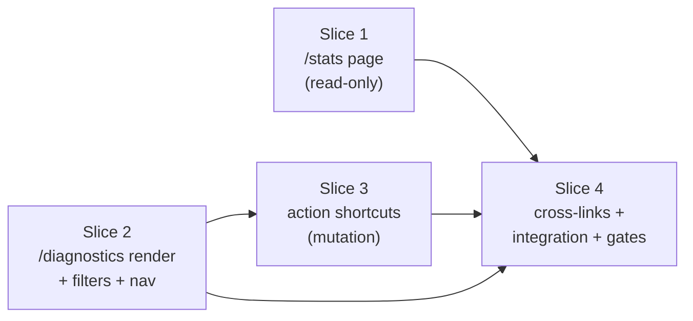

# KDI-UI-009 — Slice Plan (Review Rubric)

> Implementation decomposition for **KDI-UI-009 (Stats and Diagnostics UI)**.
> Source BRD: [`KDI-UI-009-stats-diagnostics-ui.md`](./KDI-UI-009-stats-diagnostics-ui.md) (24 FRs, 15 ACs)
> Generated by `pi.slice-planner`; status: **ready to dispatch**.

## How to use this during review

Each slice ships as its own PR. When reviewing a slice PR:

1. Open this doc and the BRD side by side.
2. Confirm the PR covers **only** the FRs/ACs listed in that slice's "Coverage" row (no scope creep into later slices).
3. Run/inspect the **Failing-eval-first tests** — they must exist and must have failed before the implementation made them pass.
4. Confirm the **Merge gate** commands were run and pass.
5. Check the slice's **review children** (frontend review / backend review / qa) were satisfied.

Slice PR descriptions **must link to this file** and call out which slice number they implement.

## Implementation state before slicing (verified)

- **Backend DONE:** `kdi stats` (KDI-019), `kdi diagnostics` (KDI-020).
- **Bridge DONE:** `apps/web/src/lib/server/bridge.ts` already exports `boardStatsJson(slug)` and `diagnosticsJson(slug, params)`.
- **API routes DONE:** `/api/boards/[slug]/stats` and `/api/boards/[slug]/diagnostics` (GET wrappers).
- **Page routes MISSING:** `/stats` and `/diagnostics` do not exist — only the catch-all `[...path]` placeholder serves them today.
- **Nav:** `/stats` is linked in `+layout.svelte`; **`/diagnostics` is NOT** (FR-19 gap → Slice 2).
- **No new flags** (FR-24). Reuses `FF_STATS`, `FF_DIAGNOSTICS`, `FF_SVELTEKIT_FRONTEND`.

## Gaps the planner found (must be closed during the slices)

| # | Gap | Owner slice | Note |
|---|-----|-------------|------|
| 1 | The bridge does **not** enforce the `FF_STATS` / `FF_DIAGNOSTICS` sub-flags. | 1 & 2 | Each page loader must add the gate (return a disabled payload when the sub-flag is off). |
| 2 | **Severity validation (FR-12)** is not done in the bridge/model — only the CLI command validates it. | 2 | The `/diagnostics` loader must reject invalid severity with `Invalid severity "...". Valid: warning, error, critical`. |
| 3 | **`comment` is not a lifecycle action** and has **no bridge write path.** `addComment` exists in `src/models/comment.ts:18` but is unwired. | 3 | Needs a new `addCommentJson` bridge helper + POST route (the only genuine new server code in this item). |
| 4 | `/diagnostics` missing from nav. | 2 | One-line `+layout.svelte` edit. |

`reclaim` / `reassign` / `unblock` action shortcuts reuse `performTaskAction` over the **existing** `POST /api/boards/[slug]/tasks/[id]/[action]` route — **zero new server code**. `cli_hint` and `open_docs` are client-only (clipboard / open tab).

---

## Slice map

- **Wave 1 (parallel):** Slice 1 ∥ Slice 2 — independent routes, flags, files.
- **Wave 2:** Slice 3 (after Slice 2).
- **Wave 3:** Slice 4 (after 1 + 2 + 3).

---

## Slice 1 — `/stats` page (render + refresh + JSON export + disabled-state)

| | |
|---|---|
| **Type / risk** | read-only / **low** |
| **Coverage** | FR-1..FR-8 · AC-01, AC-03, AC-05, AC-10(stats), AC-11 |
| **Dependencies** | none (bridge + API route done) — **ships first** |

**Scope:** Build `/stats` over `boardStatsJson` + `/api/boards/[slug]/stats`. Board resolution mirrors `activity/+page.server.ts` (`?board` → `readCurrentBoardJson()` → `"default"`). Loader gates on `FF_STATS` (bridge does not). Render 9 status buckets (zeros explicit), assignee counts (empty-state), oldest-ready age (human-readable duration + "No ready tasks" null-state). Manual refresh; JSON export matching `kdi stats --json`. Disabled-state message when `FF_STATS=false`. Board-not-found inline error. (AC-13 already satisfied by `hooks.server.ts`.)

**Likely files:**
- `apps/web/src/routes/stats/+page.server.ts` (new)
- `apps/web/src/routes/stats/+page.svelte` (new)
- `apps/web/src/lib/server/bridge.ts` (minor — add `statsFlags()` helper mirroring `activityFlags()`; import `FF_STATS`)
- duration formatter (oldest-ready age → "3h 12m") — `apps/web/src/lib/format.ts` or inline

**Failing-eval-first tests:**
- Unit `apps/web/src/lib/server/stats-diagnostics.test.ts`: seed a temp `KDI_DB` board with tasks in multiple statuses via the bridge, assert `statusCounts` matches `getBoardStats` (AC-03 parity); assert `FF_STATS=false` → disabled payload.
- HTTP smoke: spawn `bun run dev:web` against temp HOME/KDI_DB, `GET /stats?board=<slug>`, assert rendered HTML contains each status count; cross-check `kdi stats --json` on the same DB.

**Merge gate:** `bun run check:web` + `bun run build:web` + `bun test` pass.

**Review children:** frontend review (Svelte patterns, flag gating, SQLite-stays-server-side guard) · qa (FR-1..8 coverage + BRD compliance AC-01/03/05/10/11).

---

## Slice 2 — `/diagnostics` page (render + severity filter + per-task filter + refresh + JSON export + disabled-state + nav)

| | |
|---|---|
| **Type / risk** | read-only (+severity validation) / **low-medium** |
| **Coverage** | FR-9..FR-13(render), FR-15..FR-18, FR-19(nav) · AC-02, AC-04, AC-07, AC-08, AC-10(diag), AC-12, AC-16 |
| **Dependencies** | none (parallel with Slice 1) |

**Scope:** Build `/diagnostics` over `diagnosticsJson` + `/api/boards/[slug]/diagnostics`. Board resolution mirrors Slice 1. Loader gates on `FF_DIAGNOSTICS`. **Add invalid-severity rejection in the loader (Gap 2).** Render findings sorted (severity desc, task_id asc, rule asc — model already sorts this way). Severity filter via `?severity=`; per-task filter via `?task=` (404 `task_not_found` → inline error). Empty-state "No diagnostic findings." Refresh + JSON export matching `kdi diagnostics --json`. Render action *labels* from each finding's `actions` array as **non-clickable badges** (clickable wiring is Slice 3). **Add `/diagnostics` to nav (Gap 4).**

**Likely files:**
- `apps/web/src/routes/diagnostics/+page.server.ts` (new — loader + severity validation)
- `apps/web/src/routes/diagnostics/+page.svelte` (new)
- `apps/web/src/routes/+layout.svelte` (1-line — add diagnostics nav entry)
- `apps/web/src/lib/server/bridge.ts` (minor — add `diagnosticsFlags()` helper; import `FF_DIAGNOSTICS`)

**Failing-eval-first tests:**
- Unit: assert loader findings match `runDiagnostics` (AC-04); invalid severity rejected with exact CLI message; per-task filter matches `runDiagnostics(slug, { taskId })`; `FF_DIAGNOSTICS=false` → disabled payload.
- HTTP smoke: seed a finding (e.g. a `ready` task > 24h old → `stranded_in_ready`), `GET /diagnostics?board=<slug>`, assert rule/severity/task-id render; cross-check `kdi diagnostics --json`. Assert `?severity=critical` narrows; `?severity=bogus` → inline error.

**Merge gate:** `bun run check:web` + `bun run build:web` + `bun test` pass.

**Review children:** frontend review (page + severity validation + nav edit) · qa (FR-9..13, FR-15..18 + BRD compliance).

---

## Slice 3 — Diagnostics action shortcuts (reclaim / reassign / unblock / comment / cli_hint / open_docs)

| | |
|---|---|
| **Type / risk** | mutation / **medium** |
| **Coverage** | FR-14 · AC-09 |
| **Dependencies** | **Slice 2** (needs the diagnostics page) |

**Scope:** Wire the six FR-14 shortcuts onto the Slice 2 page.
- **reclaim / reassign / unblock:** reuse `performTaskAction` via the existing dynamic `POST /api/boards/[slug]/tasks/[id]/[action]` route. **No new server code.** Client: confirmation dialog for destructive actions → `apiPost` → on success re-run the diagnostics loader so the finding disappears/updates; on failure render the model error inline without leaving the page (mirror KDI-UI-006 in-dialog `role="alert"` pattern).
- **comment (Gap 3):** new `addCommentJson(slug, taskId, { text, author? })` bridge helper calling `m.addComment({ task_id, text, author })`. Wire `addComment` into the bridge `Modules` type. Author resolves via existing `resolveCurrentProfile()` (`KDI_PROFILE` → `HERMES_PROFILE` → `"user"`). Add a POST route. Client: text-input dialog → POST → refresh.
- **cli_hint:** client-only — copy the equivalent CLI command to clipboard.
- **open_docs:** client-only — open the help/doc URL in a new tab.

**Likely files:**
- `apps/web/src/lib/server/bridge.ts` (add `addComment` to `Modules` + `addCommentJson()` helper; reuse `assertTaskOnBoard` + `resolveCurrentProfile`)
- A new POST route for comment — dedicated `apps/web/src/routes/api/boards/[slug]/tasks/[id]/diagnostic-comments/+server.ts` **recommended** (comment returns a `Comment`, not a `LifecycleResult`, so it should not ride the `[action]` dynamic route) — OR extend the `[action]` route to dispatch `comment`. Reviewer to pick.
- `apps/web/src/routes/diagnostics/+page.svelte` (action-shortcut UI + dialogs + post-mutation refresh)
- Possibly `apps/web/src/lib/components/DiagnosticActions.svelte` (extract if the cluster is large)

**Failing-eval-first tests:**
- Unit: `addCommentJson` creates a comment, returns camelCase `Comment`; board-membership enforced (`task_not_found`); POST route returns 400 on empty text. Confirm existing `performTaskAction` coverage for reclaim/reassign/unblock in `task-lifecycle-actions.test.ts` — don't duplicate.
- HTTP smoke: seed a `stranded_in_ready` finding, POST `reclaim` via the UI action path, assert the finding disappears on reload (cross-check `kdi diagnostics --json`); POST `comment`, assert `kdi show <id>` lists the comment.

**Merge gate:** `bun run check:web` + `bun run build:web` + `bun test` pass; **SQLite-server-side guard test still green** (the `Modules` type change re-triggers it).

**Review children:** **backend-reviewer** (`addCommentJson` + POST route + `Modules` wiring — the only new server-mutation path) · frontend review (action UI + confirmation dialogs + in-dialog errors + post-mutation refresh) · qa (FR-14 + BRD compliance AC-09: all six shortcuts; four mutations call the same model fns as the CLI).

---

## Slice 4 — Cross-links + AC-14 integration smoke + Playwright e2e + AC-15 build gates

| | |
|---|---|
| **Type / risk** | integration / **low** |
| **Coverage** | FR-19(verify), FR-20, FR-21, FR-22 · AC-13(verify), AC-14, AC-15 |
| **Dependencies** | Slices 1 + 2 + 3 merged |

**Scope:** Complete navigation/cross-links and prove end-to-end CLI↔UI parity.
- **FR-20:** stats ↔ diagnostics bidirectional links (needs both pages merged).
- **FR-21:** task-id links in both pages → `/tasks/[id]?board=<slug>` (preserves board).
- **FR-22:** board view `/boards/[slug]` header/overflow-menu links to `/stats` + `/diagnostics`.
- **FR-19 verify:** both pages present in nav.
- **AC-14:** full integration HTTP smoke — temp HOME + temp KDI_DB, create board + tasks in mixed statuses via CLI, create a finding condition, load `/stats` + `/diagnostics`, assert rendered numbers match `kdi stats --json` + `kdi diagnostics --json`.
- **AC-13 verify:** `FF_SVELTEKIT_FRONTEND=false` → both routes 503/redirect (re-assert in smoke).
- **AC-15:** final build-gate sweep.

**Likely files:**
- `apps/web/src/routes/stats/+page.svelte` + `diagnostics/+page.svelte` (cross-link edits)
- `apps/web/src/routes/boards/[slug]/+page.svelte` or board-view component (FR-22)
- `apps/web/src/lib/server/stats-diagnostics.http.test.ts` (new — full AC-14 smoke; copies `notify-subs.http.test.ts` spawn/`killTree` pattern)
- `apps/web/e2e/stats-diagnostics.e2e.ts` (new — Playwright parity + severity filter)

**Merge gate:** `bun run lint` + `bun run build` + `bun run check:web` + `bun run build:web` + `bun test` + `bun run test:web:e2e` all pass with isolated `KDI_DB`.

**Review children:** frontend review (cross-link edits) · qa (AC-14 smoke + e2e) · **done-auditor gate** (final readiness audit against all 15 ACs).

---

## Decomposition rationale (pushback on candidate seams)

| Seam | Verdict | Reasoning |
|------|---------|-----------|
| 1. `/stats` page | **Accept** | Smallest, fully read-only, bridge/API done. Ship first. |
| 2. `/diagnostics` render + filters | **Accept** | Clean read-only split from mutations. Caveat: loader must add severity validation (Gap 2). |
| 3. Action shortcuts | **Accept** | Correct mutation seam. Caveat: `comment` needs a new `addCommentJson` + route (Gap 3); the other three reuse `performTaskAction` with zero new server code. Do **not** split `comment` further — over-decomposition (the helper is ~10 lines). |
| 4. Cross-links + nav + e2e | **Accept, reframed** | Fold per-page nav + task-id links into their owning slices (surgical). Slice 4 is the **integration + final-gate** spine (stats↔diagnostics bidirectional links + AC-14 smoke + e2e + AC-15 gates). Not trivial — AC-14/15 are the acceptance spine. |

**Over-decomposition guard:** 4 slices for 24 FRs / 15 ACs across 2 new pages + a mutation surface is the minimum that keeps each slice one-layer and independently reviewable. Merging 1+2 would couple two independent routes/flags for no review benefit.

---

## Pre-dispatch checklist

- [x] Scope fully bounded by the approved BRD.
- [x] No new flags (FR-24); no `src/models` / `src/commands` / `src/db.ts` / `src/flags.ts` edits (the only `src/`-adjacent change is the `addComment` model **import** in the bridge — the model function already exists).
- [x] Prerequisites merged: KDI-UI-000 (shell), KDI-UI-001 (bridge).
- [x] Gaps 1–4 identified and assigned to slices.
- [ ] Slice 1 merged
- [ ] Slice 2 merged
- [ ] Slice 3 merged
- [ ] Slice 4 merged (done-auditor gate passed)
