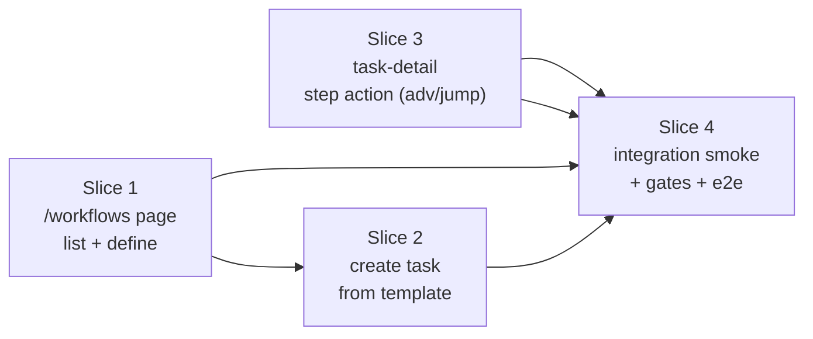

# KDI-UI-013 — Slice Plan (Review Rubric)

> Implementation decomposition for **KDI-UI-013 (Workflow Templates UI)**.
> Source BRD: [`KDI-UI-013-workflow-templates-ui.md`](./KDI-UI-013-workflow-templates-ui.md) (29 FRs, 16 ACs)
> Pattern lifted from `KDI-UI-009-slice-plan.md`.

## Implementation state before slicing (verified)

- **Backend DONE:** `kdi workflows define/list`, `kdi create --workflow-template-id`, `kdi step` (BRD-KDI-039). `FF_WORKFLOW_TEMPLATES` is **Active** (default `true`) in `src/flags.ts`.
- **Bridge PARTIAL:** `apps/web/src/lib/server/bridge.ts` already exports `workflowsJson(slug)` (list), `getWorkflowTemplateJson`, `validateStepKeyBridge`, and `createTaskJson` (accepts `workflowTemplateId`/`stepKey`). The bridge `Modules` type already wires `listWorkflowTemplates`, `getWorkflowTemplate`, `validateStepKey`, and `createTask`.
- **API route DONE:** `GET /api/boards/[slug]/workflows` already serves `workflowsJson`.
- **Page route MISSING:** `/boards/[slug]/workflows` (+page) does not exist — only the API route does.
- **Task detail surface READY for step action:** `/tasks/[id]?board=<slug>` (`apps/web/src/routes/tasks/[id]/+page.{server,svelte}`) renders `TaskDetailPanel.svelte`, which already shows `workflowTemplateId`/`currentStepKey` (read-only, from KDI-UI-005). `TaskActions.svelte` already drives lifecycle actions via `performTaskAction` → `POST /api/boards/[slug]/tasks/[id]/[action]`.
- **No new flags** (FR-28). Reuses `FF_WORKFLOW_TEMPLATES` + `FF_SVELTEKIT_FRONTEND`.

## Gaps the planner found (must be closed during the slices)

| # | Gap | Owner slice | Note |
|---|-----|-------------|------|
| 1 | Bridge `Modules` does **not** wire `defineWorkflowTemplate`, `advanceTaskStep`, `setTaskStep`. | 1 & 3 | Each needs an `import(...)` line in the `Modules` type + the loader `import(...)` array + the destructure in `loadModules()`. Model fns already exist. |
| 2 | No bridge `defineWorkflowTemplateJson` / `advanceTaskStepJson` / `setTaskStepJson` helpers (the JSON-shape wrappers the routes call). | 1 & 3 | Thin wrappers calling the wired model fns, reusing `resolveBoard`, `requireWorkflowTemplates`, `toCamel`, and `BridgeError` with the CLI error strings (FR-10..FR-13, FR-19..FR-21). |
| 3 | The workflows page is board-scoped; it is **not** a top-level nav item. It must be linked from the **board view** (`/boards/[slug]`) — same pattern as `/boards/[slug]/edit` and `/boards/[slug]/tasks/new`. | 1 | One link in the board view header/overflow; no `+layout.svelte` nav change. |
| 4 | Step-action placement on `TaskDetailPanel.svelte` must not collide with the KDI-UI-006 lifecycle-action dialog; it is a separate, always-visible (when `workflow_template_id` set) control cluster. | 3 | Render below the lifecycle actions; flag/task-status gated per FR-25. |

## Slice map

- **Wave 1 (parallel):** Slice 1 ∥ Slice 3 — independent surfaces (workflows page vs task-detail panel), independent files.
- **Wave 2:** Slice 2 (after Slice 1 — same page).
- **Wave 3:** Slice 4 (after 1 + 2 + 3).

---

## Slice 1 — `/boards/[slug]/workflows` page (list + define/upsert + empty + flag gate)

| | |
|---|---|
| **Type / risk** | read + one mutation (define) / **low-medium** |
| **Coverage** | FR-1, FR-2, FR-3, FR-4, FR-5, FR-7, FR-8, FR-9, FR-10, FR-11, FR-12, FR-13, FR-26, FR-27, FR-28, FR-29 · AC-01, AC-02, AC-03, AC-04, AC-05, AC-06, AC-13, AC-14, AC-15 |
| **Dependencies** | none — ships first (parallel with Slice 3) |

**Scope:** Build the `/boards/[slug]/workflows` page over `workflowsJson` + a new `defineWorkflowTemplateJson` helper.
- Loader resolves board via `showBoard` (404 inline error if missing/archived), returns `{ board, templates, flags: { workflowTemplates } }`. Gate on `FF_WORKFLOW_TEMPLATES` → disabled payload/message `"Workflow templates feature is not enabled."` (AC-13).
- List each template row: `template_id`, `name`, `steps.join(" → ")` (FR-4). Empty state + define form when none (FR-5).
- Define form: `template_id` (regex `^[a-zA-Z0-9_-]+$`, ≤255), `name` (non-empty, ≤255), `steps` (textarea, one key per line). Parse by newline-split + trim + drop-empty (FR-9). Submit → `defineWorkflowTemplate` (upsert; FR-8 overwrite warning when `template_id` exists).
- Validation mirrors the exact CLI error strings (FR-10..FR-13). On failure: re-render with `role="alert"` error + preserved values.
- Add bridge `defineWorkflowTemplateJson(slug, { templateId, name, steps })` (Gap 1+2: wire `defineWorkflowTemplate` into `Modules` + loader + destructure).
- Link the page from the board view (`/boards/[slug]`) header (Gap 3). **No `+layout.svelte` change** (board-scoped).
- `POST` define action is a SvelteKit form action on the route (NOT a new `/api` route) — matches KDI-UI-002/004 pattern. (A JSON `/api` define route is out of scope unless a later slice needs it; the form action is the spec's FR-8 path.)

**Likely files:**
- `apps/web/src/routes/boards/[slug]/workflows/+page.server.ts` (new — loader + define form action)
- `apps/web/src/routes/boards/[slug]/workflows/+page.svelte` (new)
- `apps/web/src/lib/server/bridge.ts` (wire `defineWorkflowTemplate` into `Modules` + loader + destructure; add `defineWorkflowTemplateJson`)
- `apps/web/src/routes/boards/[slug]/+page.svelte` (1-line — board-view link to `/boards/[slug]/workflows`)

**Failing-eval-first tests:**
- Unit `apps/web/src/lib/server/workflow-templates.test.ts`: define a template via the bridge, assert `workflowsJson` returns it and `kdi workflows list --json` (CLI) matches on the same temp `KDI_DB`; assert upsert updates `name`/`steps`; assert each validation error (bad id, empty name, empty steps, dup keys, >255 key) throws `BridgeError` with the exact CLI message; assert `FF_WORKFLOW_TEMPLATES=false` → disabled payload.
- HTTP smoke `workflow-templates.http.test.ts`: spawn `dev:web` vs temp HOME/KDI_DB, `GET /boards/<slug>/workflows`, assert rendered HTML shows template id/name/steps; cross-check `kdi workflows list`. Assert `FF_WORKFLOW_TEMPLATES=false` → disabled message; `FF_SVELTEKIT_FRONTEND=false` → 307 `/disabled`.

**Merge gate:** `bun run check:web` + `bun run build:web` + `bun test` (touched files) pass; SQLite-server-side guard green.

**Review children:** backend-reviewer (bridge `Modules` wiring + `defineWorkflowTemplateJson`) · frontend review (page, flag gate, in-form errors, board-view link) · qa (FR-1..5,7..13 + BRD ACs 01..06,13..15).

---

## Slice 2 — Create task from template (quick-create form per row + step-key validation)

| | |
|---|---|
| **Type / risk** | mutation / **low** |
| **Coverage** | FR-6, FR-14, FR-15, FR-16, FR-17 · AC-07, AC-08 |
| **Dependencies** | **Slice 1** (same page) |

**Scope:** Add a per-row **Create task from template** form to the Slice 1 page.
- Title (required) + `step_key` (optional; defaults to the template's first step). Submit → `createTaskJson(slug, { title, workflowTemplateId, stepKey })` (already in bridge — **zero new server code**).
- Custom `step_key` validated via existing `validateStepKeyBridge` before create; invalid → CLI error `Step "..." not found in workflow template "...". Valid steps: ...` (FR-15, AC-08).
- Empty title, missing template, disabled flag → exact CLI errors (FR-15).
- On success → redirect to `/boards/[slug]/tasks/[id]` (task detail) so the new task is visible (FR-16). On failure → re-render row form with `role="alert"` error + preserved title.
- Gate the form by `FF_WORKFLOW_TEMPLATES` (FR-17): absent when flag off; server action re-checks.

**Likely files:**
- `apps/web/src/routes/boards/[slug]/workflows/+page.server.ts` (add `create` form action)
- `apps/web/src/routes/boards/[slug]/workflows/+page.svelte` (per-row create form)

**Failing-eval-first tests:**
- Unit: `createTaskJson` with `workflowTemplateId` + default step → `kdi show <id>` shows same template/step (AC-07); custom valid step; invalid step → `validateStepKeyBridge` throws exact message (AC-08); disabled flag → `requireWorkflowTemplates` throws.
- HTTP smoke: seed a template, POST the quick-create form via the UI path, assert redirect + `kdi show <id>` cross-check; POST with a bad step_key → inline error, no task created.

**Merge gate:** `bun run check:web` + `bun run build:web` + `bun test` pass.

**Review children:** frontend review (per-row form, redirect, in-row errors) · qa (FR-6,14..17 + AC-07,08; createTask path identical to CLI).

---

## Slice 3 — Task-detail step action (advance / jump + reason)

| | |
|---|---|
| **Type / risk** | mutation / **medium** (separate surface: touches KDI-UI-005 panel) |
| **Coverage** | FR-18, FR-19, FR-20, FR-21, FR-22, FR-23, FR-24, FR-25 · AC-09, AC-10, AC-11, AC-12 |
| **Dependencies** | none (parallel with Slice 1 — different surface) |

**Scope:** Add advance/jump controls to `TaskDetailPanel.svelte` (and/or a small `TaskStep.svelte` component), backed by new bridge helpers.
- Wire `advanceTaskStep` + `setTaskStep` into bridge `Modules` + loader + destructure (Gap 1). Add `advanceTaskStepJson(slug, taskId, { reason? })` and `setTaskStepJson(slug, taskId, { targetKey, reason? })` (Gap 2) returning the updated camelCase `Task`.
- **Advance:** calls `advanceTaskStep`. At terminal step → `done` + clears `current_step_key` + `stepped`+`completed` events (FR-18, FR-23, AC-10). If the task's current step no longer exists in the template → CLI error `Task <id> is on step "..." which no longer exists in template "..."` (FR-21).
- **Jump:** `setTaskStep(task.id, targetKey, reason)`; `targetKey` validated via `validateStepKey` → CLI error (FR-20, AC-11).
- Reason textarea (optional, ≤4 KiB — match KDI-UI-006 reason cap) recorded on the `stepped` event (FR-22).
- No-workflow-template / missing-template → CLI errors (FR-19, AC-12): `Task <id> has no workflow template.` / `Workflow template "..." not found for task <id>. Define it with 'kdi workflows define'.`
- Controls appear only when `task.workflow_template_id` set and task not archived; disabled when `done`/`archived` (FR-25). Success messages mirror CLI (FR-23).
- Gate by `FF_WORKFLOW_TEMPLATES` (FR-24): absent when off; server action re-checks.
- POST via a SvelteKit form action on the task-detail route (reuse the `/tasks/[id]` server file) — **or** a dedicated `/api/boards/[slug]/tasks/[id]/step` route. Reviewer to pick; form action mirrors Slice 1/2.

**Likely files:**
- `apps/web/src/lib/server/bridge.ts` (wire `advanceTaskStep`/`setTaskStep`; add the two JSON helpers + `requireWorkflowTemplates` reuse)
- `apps/web/src/lib/components/TaskStep.svelte` (new — small) **or** inline block in `TaskDetailPanel.svelte`
- `apps/web/src/routes/tasks/[id]/+page.server.ts` (add `step` form action) — possibly a new `/api/boards/[slug]/tasks/[id]/step/+server.ts` if the JSON route path is preferred
- `apps/web/src/lib/components/TaskDetailPanel.svelte` (render the step controls)

**Failing-eval-first tests:**
- Unit: advance mid-template → `currentStepKey` advances + `stepped` event; advance at terminal → `done` + `completed` event (AC-10); jump valid key with reason → `stepped` event carries reason (AC-11); jump invalid key → exact CLI error (AC-12); no-template → `Task <id> has no workflow template.` (AC-12); disappeared-step → FR-21 error; disabled flag → reject.
- HTTP smoke: seed a template + a bound task via CLI, POST advance via the UI, assert `kdi show <id>` reflects the new step; POST jump; POST advance-to-terminal → `done`.

**Merge gate:** `bun run check:web` + `bun run build:web` + `bun test` pass; SQLite-server-side guard green (re-triggered by the `Modules` wiring).

**Review children:** backend-reviewer (bridge wiring + two JSON helpers + error mapping) · frontend review (panel integration, no collision with KDI-UI-006 dialog, flag/status gating, in-dialog errors) · qa (FR-18..25 + AC-09..12).

---

## Slice 4 — Integration smoke + AC-16 CLI↔UI parity + AC-15 build gates (+ e2e)

| | |
|---|---|
| **Type / risk** | integration / **low** |
| **Coverage** | AC-13(verify), AC-15, AC-16 · FR-26..FR-29 verify |
| **Dependencies** | Slices 1 + 2 + 3 merged |

**Scope:** Prove end-to-end CLI↔UI parity and close the acceptance spine.
- **AC-16 smoke** `workflow-templates.http.test.ts` (full): temp HOME + temp KDI_DB → CLI creates a board → **UI** defines a template → assert `kdi workflows list --json` matches → **UI** creates a task from the template → assert `kdi show <id>` shows expected template/step → **UI** advance through all steps → assert final `done` matches `kdi step` behavior → **UI** jump to an earlier step → assert the `stepped` event reason is recorded (cross-check via `kdi show`/event tail).
- **AC-13 verify:** `FF_SVELTEKIT_FRONTEND=false` → route 307 `/disabled`; `FF_WORKFLOW_TEMPLATES=false` → disabled payload on the page and server actions reject.
- **AC-15:** final build-gate sweep: `bun run lint` + CLI `bun run build` + `bun run check:web` + `bun run build:web` + `bun test` (full, once) with isolated `KDI_DB`.
- **Playwright e2e** `workflow-templates.e2e.ts` (optional, time permitting): open `/boards/<slug>/workflows`, define a template in the browser, create a task, advance to terminal — hydrated-browser proof.
- Carry-forward: confirm nav reachability (board view → workflows link), no orphaned `vite dev` servers (kill stale orphans per the ui-loop skill).

**Likely files:**
- `apps/web/src/lib/server/workflow-templates.http.test.ts` (extend / full AC-16 smoke; copy `notify-subs.http.test.ts` spawn/`killTree` pattern)
- `apps/web/e2e/workflow-templates.e2e.ts` (new — optional)
- STATUS.md (mark KDI-UI-013 done; record any tech debt)

**Merge gate:** `bun run lint` + `bun run build` + `bun run check:web` + `bun run build:web` + `bun test` + (optional) `bun run test:web:e2e` all pass with isolated `KDI_DB`.

**Review children:** frontend review (cross-link reachability) · qa (AC-16 smoke + e2e) · **done-auditor gate** (final readiness audit against all 16 ACs).

---

## Decomposition rationale (pushback on candidate seams)

| Seam | Verdict | Reasoning |
|------|---------|-----------|
| 1. Workflows page list + define | **Accept** | Read + the upsert mutation; bridge list exists, define is the only new server write. Ship first. |
| 2. Create task from template | **Accept** | Same page as Slice 1 but a distinct mutation (`createTask`, already bridged) with its own validation (step key). Split keeps create-from-template independently reviewable and lets Slice 1 land read+define first. **Do not merge into Slice 1** — couples two mutations on a slice that's already doing the page shell + define. |
| 3. Task-detail step action | **Accept** | Separate surface (KDI-UI-005 panel) and separate model fns (`advance`/`setStep`); parallelizable with Slice 1. Two mutation paths (advance/jump) share one server action seam — do not split further. |
| 4. Integration + gates | **Accept** | AC-16 is the CLI↔UI parity spine; not foldable into a slice that only proves one surface. |

**Over-decomposition guard:** 4 slices for 29 FRs / 16 ACs across 1 new page (with 2 mutation forms) + a task-detail mutation surface + integration is the minimum keeping each slice one-layer and independently reviewable. Slice 3 runs **parallel** with Slice 1 (independent surfaces), so wall-clock is ~3 sequential waves, not 4.

## Pre-dispatch checklist

- [x] Scope fully bounded by the approved BRD.
- [x] No new flags (FR-28); no `src/models` / `src/commands` / `src/db.ts` / `src/flags.ts` edits (the only `src/`-adjacent changes are model **imports** in the bridge `Modules` type — the model fns already exist).
- [x] Prerequisites merged: KDI-UI-000 (shell), KDI-UI-001 (bridge), KDI-UI-005 (task-detail panel, for Slice 3).
- [x] Gaps 1–4 identified and assigned to slices.
- [ ] Slice 1 merged
- [ ] Slice 2 merged
- [ ] Slice 3 merged
- [ ] Slice 4 merged (done-auditor gate passed)